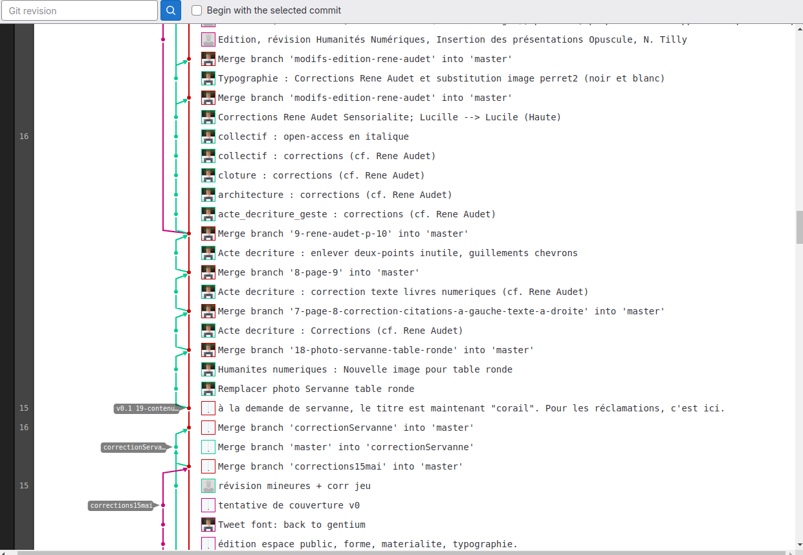

### Introduction technique, épistémique et poétique à la philosophie du 
## *Single source publishing*

<!-- .element: style="width:400px" -->

§§§§§§§§§§§§§§§§§§§§§§§§§§§§§§§§§§§§§§§§§§§§§
<!-- .slide: data-background-image="img/qr-code-cours-ens.png" data-background-size="contain"-->

§§§§§§§§§§§§§§§§§§§§§§§§§§§§§§§§§§§§§§§§§§§§§

### Avertissement 

Ce cours présente un modèle éditorial engagé !

Le *Single source publishing* est une solution aujourd'hui expérimentée par une poignée de maisons d'édition, soit de manière systématique (Abrüpt, Les cahiers de Sens public, Getty Publication), soit de manière ponctuelle (Les éditions du Louvre). Il repense entièrement la chaîne de production du livre, mais également les outils qui se sont imposés dans l'écosystème éditorial traditionnel. À terme, cette chaîne peut exercer une influence sur la production des contenus eux-mêmes, tant sur un plan poétique qu'épistémique.

<!-- .element: style="width:45%;float:left;margin-left:-1em; font-size:1.4rem; text-align:justify" -->

<!-- .element: style="width:45%;float:right;margin-right:-1em;" -->

===

L'approche dont je vais vous parler aujourd'hui, le *single source publishing*, est une solution technique numérique de production et de publication de livres à la fois numériques mais également imprimés.

Cette solution est aujourd'hui pratiquée par plusieurs maisons d'édition, soit de manière systématique (Abrüpt, Les cahiers de Sens public), soit de manière plus ponctuelle dans le cadre d'expérimentations éditoriales (Les éditions du Louvre). 

Disons-le sans détour : il s'agit d'une méthode éditoriale encore pratiquée de manière assez expérimentale, mais également assez militante.

Le Single Source publishing suppose en effet de repenser entièrement la chaîne de production du livre, mais également les outils qui se sont imposés dans l'écosystème éditorial traditionnel, avec enfin la possibilité de repenser également le mode de production des contenus eux-mêmes, tant sur un plan poétique qu'épistémique.

Le SSP est donc aujourd'hui généralement pratiqué par des personnes sensibilisées aux questions de libre accès, de logiciel libre, de mutualisation des sources. Bref, d'une philosophie d'écriture et de partage largement empruntée aux premiers hackers et à la phisolophie du web (peer to peer etc.).

%%%%%%%%%%%%%%%%%%%%%%%%%%%%%%%%%%%%%%%%%%%%%

### *Single source publishing* ?

### Éléments de définitions

 <!-- .element: style="width:300px" -->

§§§§§§§§§§§§§§§§§§§§§§§§§§§§§§§§§§§§§§§§§§§§§

### La méthode *single-source publishing*  en bref
Le *single-source publishing* désigne une méthode de production d'un objet médiatique (livre imprimé, numérique, numérique augmenté, PDF) à partir d'une source commune, dont le format permet des exports et des transformations en une multiplicité d'autres formats.

<!-- .element: style="font-size:1.4rem; text-align:justify" -->

§§§§§§§§§§§§§§§§§§§§§§§§§§§§§§§§§§§§§§§§§§§§§

### La méthode *single-source publishing* en images

 <!-- .element: style="width:45%;float:right;margin-left:-1em;" -->

 <!-- .element: style="width:45%;float:left;margin-right:-1em;" -->

§§§§§§§§§§§§§§§§§§§§§§§§§§§§§§§§§§§§§§§§§§§§§

### Le problème

- discontinuités et ruptures au stade de la production et de la publication : une multiplication de versions
- une succession d'outils et de formats à chaque "maillon" de la chaîne : des problèmes d'interopérabilité
- une publication orientée imprimé, le multiformat relégué en "post-production" : un travail chronophage, complexe, coûteux

<!-- .element: style="width:45%;float:left;margin-left:-1em; font-size:1.4rem; text-align:justify" -->

 <!-- .element: style="width:45%;float:right;margin-right:-1em;" -->

===

- discontinuités et ruptures au stade de la production et de la publication

Le texte que vous envoyez à votre directeur, celui qu'il vous renvoie : multiplication des versions.

- une succession d'outils et de formats à chaque "maillon" de la chaîne

Problème d'interropérabilité : la chaîne porte mal son nom, car elle laisse entendre que la production d'un livre s'opère de manière séquentielle comme un long fleuve tranquille, avec peu d'acteurs impliqués. 
La réalité est plus complexe.

- une publication multiformat en "post-production" : un travail chronophage, complexe, coûteux
La production du livre est aujourd'hui principalement pensée pour de l'imprimé. 
Tout ce qui va relever de la publication multimodale, notamment en numérique (epub, HTML, livre augmenté) est pensé après, alors que c'est déjà trop tard. On va remédier un livre imprimé au lieu de penser dès le premier maillon de la chaîne une sortie numérique.

§§§§§§§§§§§§§§§§§§§§§§§§§§§§§§§§§§§§§§§§§§§§§

### La solution *SSP*

* Un écosystème de publication collaboratif, où interviendront *tous* les acteurs de la chaîne
* Un format pivot à partir duquel on produira l'ensemble des formats nécessaires à la production du livre, quelle que soit sa forme médiatique (imprimé, numérique)

<!-- .element: style="width:45%;float:left;margin-left:-1em; font-size:1.4rem; text-align:justify" -->

 <!-- .element: style="width:45%;float:right;margin-right:-1em;" -->

===

§§§§§§§§§§§§§§§§§§§§§§§§§§§§§§§§§§§§§§§§§§§§§
<!-- .slide: data-background-image="img/SingleSourcePublishinModel.png" data-background-size="contain"-->

§§§§§§§§§§§§§§§§§§§§§§§§§§§§§§§§§§§§§§§§§§§§§
<!-- .slide: data-background-image="img/ssp-exemple-technique.png" data-background-size="contain"-->

§§§§§§§§§§§§§§§§§§§§§§§§§§§§§§§§§§§§§§§§§§§§§

### La philosophie (l'utopie ?)

>Single sourcing isn’t a specific solution, it is a general idea that must be intentionally designed into a publisher’s workflow. Single sourcing changes how people work and often requires a different tooling. The secret really, if we zoom out to a high-level abstraction of the problem, is to work out how the content creation and production folks can work in a shared ‘environment’ where they all work on the same files, the same source files – hence the term ‘single source’.

>CoKo Foundation

<!-- .element: style="font-size:1.4rem; text-align:justify" -->

===

Le single source n'est pas une solution spécifique, c'est une idée générale qui doit être intentionnellement conçue dans le flux de travail d'un éditeur. Le sourcing unique modifie la façon dont les gens travaillent et nécessite souvent un outillage différent. Le secret, si l'on s'en tient à une abstraction du problème, est de trouver comment les personnes chargées de la création et de la production du contenu peuvent travailler dans un "environnement" partagé où elles travaillent toutes sur les mêmes fichiers, les mêmes fichiers sources - d'où le terme "source unique".

§§§§§§§§§§§§§§§§§§§§§§§§§§§§§§§§§§§§§§§§§§§§§

Le single source publishing va-t-il sauver le monde  [de l'édition] ?

<!-- .element: style="width:400px" -->

Revenons-en aux origines du problème... et de l'écriture

%%%%%%%%%%%%%%%%%%%%%%%%%%%%%%%%%%%%%%%%%%%%%

### Les outils d'écriture numériques 

#### Une nouvelle technologie de l'intellect

<!-- .element: style="width:400px" -->

===

L'idée que l'on va avancer ici est la suivante, et peut sembler radicale : il s'agit d'expliquer que la technique n'est pas seulement le support d'une pensée, mais qu'elle en est un moteur, participant à son élaboration, et même conditionnant cette élaboration.

Pour appuyer cette idée, je vais me baser sur un concept anthropologique : le concept de technologie de l'intellect, emprunté à Jack Goody.

Une technologie de l’intellect désigne toute technologie ayant un rôle structurant et déterminant dans l’élaboration du savoir. Nous retrouvons ici notre définition initiale du media: un media vient en partie déterminer le sens de ses contenus. Il n’est pas le “passeur” neutre et transparent qu’il veut faire croire.

Considérer les techno numériques comme des technologies de l'intellect, c'est affirmer qu'elles génèrent de nouvelles capacités pour l'être humain de modéliser, raconter, conceptualiser le monde. Nous ne devenons pas forcément plus intelligent ou plus bête, nous changeons complètement de paradigme.

§§§§§§§§§§§§§§§§§§§§§§§§§§§§§§§§§§§§§§§§§§§§§

### Qu'est-ce qu'une technologie de l'intellect ?

>Le langage est unique et il nous permet de faire des choses avec notre cerveau qu’aucun animal ne pourrait mener à bien. C’est ce que j’appelle une « technologie de l’intellect ». Elle permet au cerveau de travailler de manière parfaitement originale. En effet, la structure du cerveau humain diffère de façon significative de celle des animaux qui nous sont les plus proches, c’est-à-dire ceux dont la partie gauche du cortex cérébral ressemble le plus à la nôtre. Cette spécificité s’est probablement déployée avec l’usage du langage, permettant ainsi aux générations suivantes d’améliorer leurs compétences langagières.

>Jack Goody, “Oralité et écriture”, Communication et Langages, 2007.

<!-- .element: style="font-size:1.4rem; text-align:justify" -->

===

Revenons d'abord sur le concept de « technologie de l’intellect ». Sous ce terme, Goody désigne toute technologie nous permettant de « penser » : d’élaborer une pensée structurée donc un raisonnement logique (soit, par extension, la pensée scientifique). (cf. définition détaillée ci-dessous)

La toute première technologie de l’intellect serait le langage (cf. question suivante), commun à la culture orale et à la culture écrite. Le langage est pour Goody l’une des techniques les plus importantes de l’espèce humaine : ce qui nous distingue des autres espèces vivantes (les animaux) et qui a permis le développement même de l’intelligence humaine. Si l’on sait que d’autres animaux ont eux aussi leurs propres moyens de communication, le langage humain se distingue par sa capacité à nommer le monde, et davantage encore, à le conceptualiser : on nommera et on définira ce qui n’est pas concrètement là, ce qui n’est pas palpable (le temps, les émotions…). Le langage permet donc la pensée.

CITER

À noter que le langage permet aussi l’apparition de la spiritualité, de la religion : le langage permet de formaliser ce qui n'est pas là concrètement :

>Une partie des entités absentes auxquelles nous faisons référence (certains diraient que nous créons) sont des entités religieuses, des êtres surnaturels que nous ne pouvons pas percevoir directement (si ce n’est « spirituellement » en pensée, dans notre imagination). En d’autres termes, les êtres humains peuvent découvrir et peut-être même créer du religieux. Ils créent des êtres surnaturels qui ne sont pas là par « nature » et, diraient certains agnostiques, qui n’existent peut-être pas du tout en dehors de notre imagination.

§§§§§§§§§§§§§§§§§§§§§§§§§§§§§§§§§§§§§§§§§§§§§
<!-- .slide: data-background-image="img/hieroglyphes.jpeg" data-background-size="contain" -->
<!-- .slide: class="hover" -->

### L'invention de l'écriture : retour sur une mutation épigénétique

* première technologie humaine, à l'origine de toutes les autres
* 4000 - 3500 av JC = écritures picto-idéographique
* 3200 av JC = hiéroglyphes

<!-- .element: style="font-size:1.4rem; text-align:justify" -->

===

La première grande révolution technique de l'humanité selon Goody = invention de l'écriture.

Entre 4000 et 3500 ans avant notre ère, l’homme invente l’écriture. Nous avons du mal à l’envisager comme cela, mais il faut considérer l’écriture est l’une de nos premières technologies.

Les premières formes d’écriture sont localisées en Mésopotamie, au IVe millénaire avant J.-C., où l’on invente une écriture picto-idéographique (images simplifiées qui désignent êtres et choses) fondatrice du cunéiforme.

Évidemment, l’une des formes d’écriture ancienne les plus connues sont les hiéroglyphes, originaires d’Égypte, qui sont pourtant beaucoup plus tardifs (32000 ans).

§§§§§§§§§§§§§§§§§§§§§§§§§§§§§§§§§§§§§§§§§§§§§
<!-- .slide: data-background-image="img/alphabetGrec.png" data-background-size="contain" -->
<!-- .slide: class="hover" -->

* 1000 av JC = écriture alphabétique (un code abstrait)

===
L’écriture alphabétique est quant à elle encore plus récente, puisqu’elle a été inventée 1000 ans avant notre ère.
L’écriture est l’une de nos premières technologies, et à bien des égards, celle qui a permis toutes les autres car elle est allée de pair avec l’inscription et la diffusion des savoirs.

L'écriture alphabétique est un code : phénomène d'abstraction.

S'il est une technique qui caractérise tout particulièrement la civilisation occidentale, c'est donc l'écrit.

Nous sommes donc une civilisation de l'écrit. Tout ou presque, dans nos sociétés occidentales contemporaines, passe par l,écrit.

L'écrit fait autorité. Chez nous, c'est même l'écrit qui fait "civilisation" : l'écrit, c'est son message, est devenu le signe de l'espèce civilisée. L'écriture, le livre (entendu comme codex), s'inscrivent dans notre histoire comme des outils à la base du développement de notre civilisation.

L'écrit est aussi ce qui régit nos relations sociales :
Rien de plus rassurant que de signer un contrat, un bail. L'écrit fait davantage autorité que la parole.

§§§§§§§§§§§§§§§§§§§§§§§§§§§§§§§§§§§§§§§§§§§§§

### Une "raison" graphique
* Jack Goody *La Raison graphique* (*The Domestication of the Savage Mind*, 1977)
* Approche anthropologique
* Une technique qui a suscité des mutations humaines profondes

<!-- .element: style="font-size:1.4rem; text-align:justify" -->

===

Jack Goody, anthropologue anglais (né en 1919) en fait l’une des plus importantes inventions de l’humanité.

Sa thèse est exposée entre autres dans *La Raison graphique* (*The Domestication of the Savage Mind*, 1977) et se résume en 3 temps :

§§§§§§§§§§§§§§§§§§§§§§§§§§§§§§§§§§§§§§§§§§§§§

1. L'écriture est l’un des premiers moyens d’archivage des informations
2. L'écriture est donc aussi à l’origine d’un travail d’organisation du savoir en catégories
3. L’écriture a permis le développement de la pensée logique, de l’abstraction et finalement de la science

<!-- .element: style="font-size:1.7rem; text-align:justify" -->

===

1. L'écriture est l’un des premiers moyens d’archivage des informations

L'écriture traduit certes une préoccupation de la transmission des savoirs, des traditions, des cultures.

Mais elle a d’abord servi des fonctions pratiques : il s’agissait surtout de transmettre des comptes, des décisions de droit, etc.

La plupart des tablettes cunéiformes que l'on a retrouvées sont en fait des tickets de caisse...

Mais très rapidement, elle a permis la transcription et la transmission d’un savoir et d’une culture accumulés auparavant au sein de la tradition orale.

L’une des plus anciennes oeuvres littéraires qui nous aient été transmises est l’épopée de Gilgamesh. Cette épopée relate l'histoire de Gilgamesh, roi et tyran de la ville d'Uruk en Mésopotamie, qui va chercher à atteindre l’immortalité.

- 2. L'écriture est donc aussi à l’origine d’un travail d’organisation du savoir en catégories.
« Dispositif spatial de triage de l'information », l'écriture permet, si on peut se permettre l'expression, une forme de "stockage visuel".

L'écriture va rapidement donner lieu à un principe d'organisation des données par différents moyens de représentation graphique (listes, tableaux, inventaires, registres, etc.).

Ces représentations graphiques issues de l'écriture favorisent non seulement l'enregistrement mais aussi la réorganisation de l'information : c'est-dire la curation des informations.

Ainsi et surtout,

- 3. L’écriture a permis le développement de la pensée logique, de l’abstraction et finalement de la science.

L'écriture s'affranchit des contextes de l'énonciation - de l'oralité, ce qui encourage l'abstraction et surtout la décontextualisation du savoir.

Vous le savez bien vous-mêmes, dans vos travaux écrits, vous avez tendance à adopter un raisonnement qui n'est pas le même qu'à l'oral : déformation française = le tripartisme !

Le texte écrit va favoriser la construction d'une connaissance systématique. L'écrit rend visible la contradiction, il permet de confronter et de recouper les informations. C'est aussi l'émergence du scepticisme critique, du doute philosophique, bref d'un savoir scientifique.

§§§§§§§§§§§§§§§§§§§§§§§§§§§§§§§§§§§§§§§§§§§§§
<!-- .slide: data-background-image="img/mondot2.jpg"  -->

===

L’écriture permet à l’homme d’inscrire et d’extérioriser sa mémoire et ses connaissances sur des supports matériels qui lui survivent. Aussi, contrairement aux sociétés orales où le savoir des anciens se transmettait à la seule génération suivante, les sociétés dites «écrites» pouvaient s’appuyer sur les connaissances relevant de plusieurs générations antérieures. C’est la conséquence la plus marquante, qui a notamment permis la mise en place d’institutions toujours plus pérennes car fondées sur des écrits structurants et persistants.

Avec le concept de « raison graphique », Goody explique comment le cerveau humain (ou la cognition) s’est réorganisé grâce à l’écriture. D’une part, avec les supports matériels de l’écrit, le cerveau se déleste de la charge cognitive de la mémoire.

C'est ce qui faisait si peur à Platon. Mais Goody montre les aspects positifs de cette décharge : l'humain peut donc s’investir à d’autres tâches comme la réflexion, le raisonnement, l’interprétation, etc.

D’autre part, l’extériorisation du discours sur un support permet à l’homme de porter un regard distancié sur le discours écrit, que ce soit le sien, ou un discours plus ancien. C’est le principe de réflexion : la pensée se réfléchit sur le support, et justement réfléchit. C’est le fameux mythe où Pythagore découvre ses théroèmes en traçant sur le sable des triangles. C’est l’inscription de ces triangles qui lui permettent d’établir une pensée sur ces triangles.

Prenons un chant sacré dans une société orale. Ce chant n’est inscrit que dans la mémoire des hommes et des femmes, on parle parfois d’inscription corporelle tant son chant s’accompagne de danses ou de gestuelles qui lui donne son rythme et même sa signification. Dans cette pratique, il n’y a pas de place pour l’interprétation. Mais son inscription sur un support matériel désacralise immédiatement son discours, car une fois inscrit, il peut être relu, interprété et critiqué.

Que s’est-il passé ? L’écriture, mais déjà le langage, introduit une nouvelle médiation dans le processus de pensée.

§§§§§§§§§§§§§§§§§§§§§§§§§§§§§§§§§§§§§§§§§§§§§

### De nouvelles technologies de l'intellect

Dans le cadre d'une réflexion sur les bouleversements induits par le numérique, on peut considérer les logiques informatiques comme des technologies de l'intellect. Alors il ne s'agira pas tant de dire que votre ordi ou votre Iphone est une technologie de l'intellect, mais que **les protocoles et les langages informatiques** relèvent de ce concept.

<!-- .element: style="font-size:1.4rem; text-align:justify" -->

===

Ainsi, dans le cadre d'une réflexion sur les bouleversements induits par le numérique, on peut considérer les logiques informatiques comme des technologies de l'intellect. Alors il ne s'agira pas tant de dire que votre ordi ou votre Iphone est une techno de l'intellect, mais que les protocoles et les langages informatiques relèvent de ce concept.

Par exemple, l'hypertexte est particulièrement intéressant de ce point de vue :
- il ne cesse d'établir des liens entre les objets, favorisant une pensée que certains qualifieront de zapping, mais qui se caractérise également par une capacité à créer des réseaux de signification. Ceux d'entre vous qui aiment les digressions, les "Liens faibles", comprendront bien de quoi il s'agit
- l'hypertexte est également participatif, il établit un nouveau régime d'autorité davantage horizontal. Sur le web tout le monde peut publier : plus besoin de passer par une médiation verticales.

%%%%%%%%%%%%%%%%%%%%%%%%%%%%%%%%%%%%%%%%%%%%%

### Et vous ? 

#### Comment envisagez-vous votre thèse ?

<!-- .element: style="width:400px" -->

§§§§§§§§§§§§§§§§§§§§§§§§§§§§§§§§§§§§§§§§§§§§§

## Questions d'usages et de littératie numériques

La thèse est un travail intellectuel, c'est également un travail éditorial. Comment imaginez-vous concrètement l'objet thèse ? Sa réalisation matérielle ?

<!-- .element: style="font-size:1.4rem; text-align:justify" -->

§§§§§§§§§§§§§§§§§§§§§§§§§§§§§§§§§§§§§§§§§§§§§

### Quel est votre système d'exploitation ?

§§§§§§§§§§§§§§§§§§§§§§§§§§§§§§§§§§§§§§§§§§§§§

### Avec quel outil écrivez-vous... 

* Vos notes de cours ?
* Vos notes de lecture ?
* Votre thèse ?
* Vos brouillons de thèse ?
* Vos articles ?
* Vos communication orales ?
* Vos cours ?

<!-- .element: style="font-size:1.4rem; text-align:justify" -->

§§§§§§§§§§§§§§§§§§§§§§§§§§§§§§§§§§§§§§§§§§§§§

### Avec quels outils annotez-vous...

* Vos travaux universitaires ?
* Vos livres (numériques, imprimés) ?
* Votre matériel scientifique et pédagogique ?
* Le web ?

* Annoter, moi ? Jamais ! Je refuse d'abîmer mes bouquins. J'écris des notes de lecture sur un carnet en papier vélin, à la plume d'oie.

<!-- .element: style="font-size:1.4rem; text-align:justify" -->

§§§§§§§§§§§§§§§§§§§§§§§§§§§§§§§§§§§§§§§§§§§§§

### Pourquoi avez-vous choisi ces outils ? 

§§§§§§§§§§§§§§§§§§§§§§§§§§§§§§§§§§§§§§§§§§§§§

### Connaissez-vous des alternatives ?

§§§§§§§§§§§§§§§§§§§§§§§§§§§§§§§§§§§§§§§§§§§§§

### Quel est le format des fichiers que vous produisez ? 

===

§§§§§§§§§§§§§§§§§§§§§§§§§§§§§§§§§§§§§§§§§§§§§

>NeMeParlezPasDeMaThese.pdf

===

Une définition : Le format désigne la nature d'un document informatique et permet d'identifier le logiciel nécessaire à sa lecture. Chaque fichier porte une extension en 3 lettres en général et indiquant le format.

§§§§§§§§§§§§§§§§§§§§§§§§§§§§§§§§§§§§§§§§§§§§§
<!-- .slide: data-background-image="img/formatOuvertFerme.png" data-background-size="contain"-->

§§§§§§§§§§§§§§§§§§§§§§§§§§§§§§§§§§§§§§§§§§§§§

### Pourquoi évaluer sa littératie numérique avant de se lancer dans l'écriture d'une thèse ? 

> Le terme « littératie » est la traduction du mot anglais literacy et l’antonyme d’illettrisme. Il signifie, au-delà de l’alphabétisme, la capacité de mobiliser l’écriture, ou celle de comprendre et
utiliser l’information écrite. [...] Dans un monde idéal, on ne devrait pas utiliser Google sans comprendre Google. Il faudrait peut-être, pour cela, commencer à manier les propres outils de Google – notamment les outils Ngrams, Google Correlate et Google Trends– pour introduire à la logique de leur écriture.

<!-- .element: style="font-size:1.4rem; text-align:justify" -->

>Serge Bouchardon et Victor Petit, "L’écriture numérique ou l’écriture selon les machines. Enjeux philosophiques et pédagogiques"

<!-- .element: style="font-size:1.4rem; text-align:justify" -->

===

Ces questions ne constituent pas un piège, elle ne visent pas à émettre un jugement.

Il s'agit de vous sensibiliser à ce que l'on va appeler votre degré de littératie numérique.

La littératie est un concept emprunté au monde anglo-saxon, mais qui est de plus en plus employé dans la sphère francophone. Il désigne de manière assez largez notre capacité à maîtriser les outils numériques. Tout le débat est de comprendre ce que l'on range sous le terme "maîtriser". Il y a certainement plusieurs degrés de connaissances :

- taper une requête dans le moteur de recherche GOogle
- être conscient que ces résultats ne sont pas objectifs ni même arbritraires, mais savoir qu'ils reposent sur un algorithme
- savoir ce qu'est un algorithme (qui écrit l'algo, etc)
- connaître les règles de classement de l'algorithme GOogle
- être capable soi-même de coder un algorithme

Évidemment tout le monde de peut pas connaître cela. Mais on comprend que l'enjeu est de monter en compétence théoriques -- sans forcément aller du côté de la pratique.

%%%%%%%%%%%%%%%%%%%%%%%%%%%%%%%%%%%%%%%%%%%%%

### Inventer le livre numérique 

#### Une problématique de la remédiation

<!-- .element: style="width:400px" -->

§§§§§§§§§§§§§§§§§§§§§§§§§§§§§§§§§§§§§§§§§§§§§

Une expression imprécise pour des questionnements variés :
- Livre conçu à l'aide des technologies numériques
- Livre conçu pour une diffusion et une lecture numérique
- Un livre numérique, c'est quoi ? Du livre "homothétique" au livre augmenté.

<!-- .element: style="font-size:1.4rem; text-align:justify" -->

Nous sommes encore en train d'inventer le livre numérique, au sens où ce livre pourrait produire une expérience de lecture -- et avant cela d'écriture -- tirant profit des potentialités techniques, esthétiques, poétique et épistémiques des technologies numériques.

<!-- .element: style="font-size:1.4rem; text-align:justify" -->

===

Dans l'absolu, aujourd'hui, tt les livres sont fait en PAO.

La question du livre diffusé via un système numérique et pour une lecture sur un support numérique, c'est déjà plus précis.

Un livre numérique, à proprement parler, c'est quoi ? Un livre que je lis sur mon ordi ou sur ma tablette, c'est pas mal, mais fondamentalement, est-ce que cela exploite les potentialités technologiques offertes par le numérique ? Pas vraiment.

Nous sommes encore en train d'inventer le livre numérique, au sens où ce livre pourrait produire une expérience de lecture -- et avant cela d'écriture -- tirant profit des potentialités techniques, esthétiques, poétique et épistémiques des technologies numériques.

§§§§§§§§§§§§§§§§§§§§§§§§§§§§§§§§§§§§§§§§§§§§§

### Remédiation ? Le concept de Bolter et Grusin
* Un ouvrage de référence : *Remediation: Understanding New Media*, MIT press, 1998
* Une relation intermédiale dans la logique évolutive des medias
* Effet de mimétisme, de "vampirisation", d'emprunt voire de plagiat
* Un media "familier" a plus de chance d'être adopté

<!-- .element: style="width:45%;float:left;margin-left:-1em; font-size:1.7rem; text-align:justify" -->

<!-- .element: style="width:45%;float:right;margin-right:-1em;" -->

===
Ouvrage de référence : Jay David Bolter, Richard Grusin,*Remediation : Understanding New Media*. Bolter et Grusin ont vu dans la relation intermédiale une logique évolutive des médias. C’est-à-dire que c’est dans la nature de tout nouveau média que de plagier son aîné.

Le concept de remédiation souligne d’abord une répétition, la trace d’un ancien médium dans un nouveau = il s’agit de vampiriser les formes connues, familières, quotidiennes, pour mieux s’intégrer auprès du public contemporain.

En gros : le public aime ce qui lui est familier. // la question de la forme chez Yvez Citton.

§§§§§§§§§§§§§§§§§§§§§§§§§§§§§§§§§§§§§§§§§§§§§

### La relation intermédiale

>"L’émergence d’un nouveau média conduit également à une transformation de la forme prise par les médias existants. Pour comprendre cela, il est important de ne pas adopter une définition essentialiste de ce que sont les médias. Au contraire, il s’agit de les considérer comme des formes modulable sans cesse en cours de (re)configuration."

>Remy Besson, "Prolégomènes pour une définition de l'intermédialité"

<!-- .element: style="font-size:1.7rem; text-align:justify" -->

===

Besson : "L’émergence d’un nouveau média conduit également à une transformation de la forme prise par les médias existants. Pour comprendre cela, il est important de ne pas adopter une définition essentialiste de ce que sont les médias. Au contraire, il s’agit de les considérer comme des formes modulable sans cesse en cours de (re)configuration."

Présupposé : nature hétérogène des media. Parti pris absolument non essentialiste.
Ce qui signifie : pas de définition stable du media, qui est toujours en processus de construction.

§§§§§§§§§§§§§§§§§§§§§§§§§§§§§§§§§§§§§§§§§§§§§

### La *mimesis* médiatique : comment mieux "médier" le réel
* L'utopie de l'effacement du médium
* Un effacement qui procède aussi d'une sécularisation des media

===

L'origine de la remédiation est en fait la problématique première de la médiation : comment médier le monde ?
Comment donner accès au réel ?

§§§§§§§§§§§§§§§§§§§§§§§§§§§§§§§§§§§§§§§§§§§§§

### La remédiation : deux stratégies possibles
* Immédiateté (*immediacy*)
* Hypermédiateté (*hypermediacy*)

§§§§§§§§§§§§§§§§§§§§§§§§§§§§§§§§§§§§§§§§§§§§§

### 1. Immediacy : la logique de la "transparence"

>What designers often say they want is an “interfaceless” interface, in which there will be no recognizable electronic tools—no buttons, windows, scroll bars, or even icons as such. Instead the user will move through the space interacting with the objects “naturally,” as she does in the physical world. Virtual reality, threedimensional graphics, and graphical interface design are all seeking to make digital technology “transparent.” In this sense, a transparent interface would be one that erases itself, so that the user is no longer aware of confronting a medium, but instead stands in an immediate relationship to the contents of that medium.

<!-- .element: style="font-size:1.6rem; text-align:justify" -->

===
"Ce que disent les designers, c'est qu'ils veulent une interface "sans interface", dans laquelle il n'y aura pas d'outils électroniques reconnaissables - pas de boutons, de fenêtres, de scroll-barres, ni même d'icônes en tant que telles. Au lieu de cela, l'utilisateur se déplacera dans l'espace en interagissant avec les objets "naturellement", comme il le fait dans le monde physique. La réalité virtuelle, les graphiques tridimensionnels et la conception des interfaces graphiques visent tous à rendre la technologie numérique "transparente". En ce sens, une interface transparente serait une interface qui s'efface d'elle-même, de sorte que l'utilisateur n'est plus conscient de se confronter à un support, mais se trouve au contraire dans une relation immédiate avec le contenu de ce support."

§§§§§§§§§§§§§§§§§§§§§§§§§§§§§§§§§§§§§§§§§§§§§
<!-- .slide: data-background-video="img/phallainaChap1.mp4" data-background-size="contain" -->

§§§§§§§§§§§§§§§§§§§§§§§§§§§§§§§§§§§§§§§§§§§§§

### 2. Hypermediacy : la logique de l'emprunte médiatique (car "Le médium, c'est le message")

>If the paintbox software is ‘intuitive,’ it is only intuitive because the paintbox is a culturally
familiar object. In fact, the graphical interface referred not only to culturally familiar objects, but specifically to prior media, such as painting, typewriting, and handwriting. In making such references,
computer designers were in fact creating a more complex system in which iconic and arbitrary forms of representation interact.

<!-- .element: style="font-size:1.7rem; text-align:justify" -->
===

Si le logiciel "paintbox" est "intuitif", c'est uniquement parce que la boîte de peinture est un objet culturel familier. Ainsi, l'interface graphique ne se réfère pas seulement à des objets culturellement familiers, mais aussi à des supports antérieurs, tels que la peinture, la dactylographie et l'écriture manuscrite. En faisant de telles références, les designers informatiques ont en fait créé un système plus complexe dans lequel interagissent des formes de représentation iconiques et arbitraires.

Ici, il s'agit cette fois de surjouer la présence du media, généralement d'un ancien media, dont on reprend des codes graphiques, sonores, kinésiques...

§§§§§§§§§§§§§§§§§§§§§§§§§§§§§§§§§§§§§§§§§§§§§
<!-- .slide: data-background-image="img/word.png" data-background-size="contain" -->

§§§§§§§§§§§§§§§§§§§§§§§§§§§§§§§§§§§§§§§§§§§§§

### Les remédiations du livre à travers l'histoire

===

Le livre n'en est pas à sa première remédiation

§§§§§§§§§§§§§§§§§§§§§§§§§§§§§§§§§§§§§§§§§§§§§

### Première époque : du volumen au codex

§§§§§§§§§§§§§§§§§§§§§§§§§§§§§§§§§§§§§§§§§§§§§
<!-- .slide: data-background-image="img/volumen2.jpeg" data-background-size="contain"-->

§§§§§§§§§§§§§§§§§§§§§§§§§§§§§§§§§§§§§§§§§§§§§

* L'invention de la page (et de l'architecture du savoir : sommaires, index, pages de titre et de couverture)
* De nouveaux gestes de lecture
* La trace du *volumen* dans le lexique éditorial (le "volume")

§§§§§§§§§§§§§§§§§§§§§§§§§§§§§§§§§§§§§§§§§§§§§

### Deuxième époque : du manuscrit à l'imprimé

§§§§§§§§§§§§§§§§§§§§§§§§§§§§§§§§§§§§§§§§§§§§§
<!-- .slide: data-background-image="img/incunable.jpg" data-background-size="contain"-->

§§§§§§§§§§§§§§§§§§§§§§§§§§§§§§§§§§§§§§§§§§§§§

### Les "incunables"
* Les incunables désignent les premiers livres fabriqués dans les décennies qui ont suivi l'invention de Gutenberg
* Des livres imprimés... qui imitent le manuscrit !

§§§§§§§§§§§§§§§§§§§§§§§§§§§§§§§§§§§§§§§§§§§§§

### Troisième époque : de l'imprimé au numérique (et vice-versa...)

===

Troisième époque : l'arrivée de l'imprimé.
Contrairement à mes deux précédentes révolutions, je voudrais qd même revenir sur cette tentation téléologique : l'opposition qui a longtemps prévalu pour penser l'imprimé et le numérique n'est sans doute pas si juste.

Après avoir imaginé que l'un chasserait l'autre, nous nous sommes plutôt résolus à penser ces deux formes médiatiques en termes de complémentarité. J'y reviendrai en détails, mais je le précise préalablement pour justifier mon titre : de l'imprimé au numérique et "Vice-versa" : on réalisera que de très nombreuses oeuvres littéraires, essayistiques, etc. qui sont natives numériques, finissent par trouver une nouvelle vie dans un modèle imprimé.

La remédiation de l'imprimé par le numérique ne s'effectue donc nullement sur le mode d'une technologie chassant l'autre. On est sur la réalisation d'objets hybrides, de plus en plus complémentaires. Pas de "ceci tuera cela".s

Mais n'allons pas trop vite en besogne et observons de plus près ce fameux "livre numérique".

§§§§§§§§§§§§§§§§§§§§§§§§§§§§§§§§§§§§§§§§§§§§§

### Le "livre numérique" n'existe pas...
* Une "adaptation" de l'imprimé à un mode de consultation/diffusion numérique (= livres homothétiques)
* Des propositions techniques et conceptuelles natives numériques (oeuvres hypermédiatiques, livres-appli, etc.)
* Une production hybride : complémentarité imprimé & numérique ; PAO (publication assistée par ordinateur)

<!-- .element: style="font-size:1.4rem; text-align:justify" -->

===

Parler de "Livre numérique" n'a en soit aucun sens : l'édition numérique recouvre en vérité une multitude de pratiques dessinant un très large spectre depuis une adaptation très basique du livre imprimé pour un mode de consultation / diffusion numérique (ce que l'on va appeler le livre "homothétique"), jusqu'à des conception conception du livre directement pensée pour la lecture numérique.

Entre les deux extrémités de ce spectre, on retiendra que désormais, quoiqu'il arrive, la production d'un livre fait nécessairement appel à une technologie numérique. C'est notamment ce que l'on appelle la PAO (publication assistée par ordinateur).

>La PAO consiste à préparer des documents destinés à l'impression à l'aide d'un ordinateur en lieu et place des procédés historiques de la typographie et de la photocomposition.

Ces procédés étaient essentiellement manuels jusque dans les années 80-90. On est donc sur des technologies récentes, qui ont conduit au développement d'une informatisation massive de la production des livres, avec ce que cela entraîne en termes de compétences.

>La publication assistée par ordinateur se fait à l'aide de logiciels spécialisés, appelés logiciels de mise en page ou logiciels de PAO, semblables à des logiciels de traitement de texte ordinaires, mais où un accent particulier a été mis sur la disposition des textes et des images sur une page.

§§§§§§§§§§§§§§§§§§§§§§§§§§§§§§§§§§§§§§§§§§§§§

### Un livre numérique encore largement "homothétique"

Transposition à l'identique d'un livre imprimé en version numérique, investissement minimal des potentialités de la technologie numérique.

<!-- .element: style="font-size:1.4rem; text-align:justify" -->

===

Je ne me lancerai pas dans une typologie du livre numérique, car ce serait trop hasardeux.

Cependant, on peut reconnaître trois grandes familles de livres conçues pour la diffusion et la lecture numérique, familles que je distingue en fonction d'intentions éditoriales voire esthétiques.

1) Version homothétique.

Le premier, et le plus répandu, est le livre électronique « homothétique », qui est une transposition à l’identique d’un livre papier en version numérique.

Depuis 2010 environ, les nouveautés publiées par la majorité des maisons d’édition sont immédiatement disponibles en version « homothétique ». Le prix des livrels avoisine généralement 75 % du coût de la version papier et peut s’élever à 100 % (dans le cas des livres présentant de nombreuses illustrations, par exemple). Les livrels sont souvent protégés contre la copie par filigrane et parfois par verrou numérique (DRM, Digital Rights Management).

Michel Morvan :

>Les lecteurs lisent en effet de plus en plus en numérique (la proportion a notamment particulièrement augmenté pendant la crise Covid) mais encore moitié moins que sur papier. La prééminence du papier reste cependant une spécificité française qui est en partie due à la loi sur le prix unique du livre qui donne aux libraires une place très importante dans toute la chaîne du livre. Ainsi, la concurrence jouant très peu entre les librairies, il est très important pour les éditeurs papier de ne pas mécontenter les libraires dont ils ne peuvent pas se passer et entre lesquels le prix unique empêche de faire jouer la concurrence.

>Et cela a pour conséquence que les éditeurs papier qui publient aussi en numérique (c’est-à-dire la quasi-totalité d’entre eux) ont choisi d’avoir une politique de prix numérique élevée. Il est ainsi rare que le livre numérique soit vendu à moins de 30 % du prix du livre papier. Cela freine évidemment considérablement le développement du livre numérique.

https://www.unidivers.fr/livre-numerique-michel-morvan/

§§§§§§§§§§§§§§§§§§§§§§§§§§§§§§§§§§§§§§§§§§§§§
<!-- .slide: data-background-image="img/epub1.png" data-background-size="contain"-->

§§§§§§§§§§§§§§§§§§§§§§§§§§§§§§§§§§§§§§§§§§§§§
<!-- .slide: data-background-image="img/epub2.png" data-background-size="contain"-->

§§§§§§§§§§§§§§§§§§§§§§§§§§§§§§§§§§§§§§§§§§§§§
<!-- .slide: data-background-image="img/epub3.png" data-background-size="contain"-->

§§§§§§§§§§§§§§§§§§§§§§§§§§§§§§§§§§§§§§§§§§§§§

### Vers des propositions de livre enrichi
Le livre enrichi utilise les possibilités techniques du format numérique afin d’apporter un enrichissement, autant au contenu qu’à la mise en forme de l’ouvrage imprimé qu’il vient compléter. Il s'agit d'ajouter une plus-value au livre.

<!-- .element: style="font-size:1.4rem; text-align:justify" -->

===

le livre enrichi, qui prend une place de plus en plus importante : il utilise les possibilités techniques du format numérique afin d’apporter un enrichissement, autant au contenu qu’à la mise en forme de l’ouvrage imprimé qu’il vient compléter.

Beaucoup de cas différents : collection Parcours numériques : des livres imprimés sans illustration.

Des illustrations sur un site web.

On a donc deux objets, qui fonctionnent indépendamment mais s’apportent une plus-value mutuelle très forte.

§§§§§§§§§§§§§§§§§§§§§§§§§§§§§§§§§§§§§§§§§§§§§
<!-- .slide: data-background-video="img/Collection Histoires animées.mp4" data-background-size="contain"-->

===

Phénomène très utilisé en jeunesse

§§§§§§§§§§§§§§§§§§§§§§§§§§§§§§§§§§§§§§§§§§§§§

### Les expérimentations hypermédiatiques
Oeuvre numérique, qui joue des potentialités techniques du media numérique (plurimédiatique, immersif, interactif...). Positionnement esthétique en faveur de la création de nouvelles formes livresques, émancipées du modèle imprimé.

<!-- .element: style="font-size:1.4rem; text-align:justify" -->

===

le livre hypermédiatique. Créé par et pour le numérique, et non en complément ou par imitation d’un « original papier ».

On ne trouve ces livres que dans un format numérique (voir le manifeste pour une littérature hypermédiatique).

http://revuebleuorange.org/oeuvre/08/livres-dartistes-livres-numeriques-manifeste

Il s'agit d'un positionnement esthétique, avec l'idée que l'expérience de lecture que l'on souhaite produire ne peut être conçue qu'à partir de technologies numériques.

§§§§§§§§§§§§§§§§§§§§§§§§§§§§§§§§§§§§§§§§§§§§§
<!-- .slide: data-background-image="img/bleuOrange08-bis.png" data-background-size="contain"-->

===

Exemple du manifeste de la revue BleuOrange, paru en 2015.

>L’OBJET LIVRE FACE AU NUMÉRIQUE VIENT SOULEVER DES PROBLÉMATIQUES PROPRES À LA RENCONTRE DE DEUX MÉDIAS. LES PRODUCTIONS D’ARTISTES ABORDANT CES QUESTIONS S’INSCRIVENT DANS UN CHAMP DE TENSIONS SE DÉVELOPPANT ENTRE LIVRE PAPIER, LIVRE-OBJET PLASTIQUE ET LIVRE NUMÉRIQUE.

>LE LIVRE PAPIER ÉDITÉ S’INSCRIT DANS UNE ÉCONOMIE (D’OFFRE ET DE DEMANDE, DE REPRODUCTIBILITÉ) DONT LE LIVRE D’ARTISTE (PIÈCE UNIQUE, FANZINE OU MULTIPLE) S’ÉMANCIPE. LA LECTURE DU PREMIER S’ACCOMPAGNE D’UNE CERTAINE TRANSPARENCE DE L’ÉNONCIATION ÉDITORIALE, DE L’OUBLI DU SUPPORT MATÉRIEL AU PROFIT D’UNE RECHERCHE D’«IMMERSION» (EN PARTICULIER DANS LES TEXTES DE FICTION), JUSQU’AUX JEUX PLASTIQUES LES PLUS DIVERS. CETTE DERNIÈRE DÉMARCHE INTERROGE LA FORME DU LIVRE-OBJET. CELUI-CI DÉBORDE DE LA DÉFINITION TRADITIONNELLE DU «LIVRE», JUSQU’À PARFOIS LA METTRE À MAL. DES EXPÉRIMENTATIONS D’ARTISTES SUR LES FORMES PLASTIQUES, LE VOLUME ET LE SUPPORT ATTRIBUÉS À CE LIVRE-OBJET METTENT AU DÉFI LES PRATIQUES DE LECTURE.

§§§§§§§§§§§§§§§§§§§§§§§§§§§§§§§§§§§§§§§§§§§§§
<!-- .slide: data-background-image="img/bleuOrange08.png" data-background-size="contain"-->

===

>NOUS DISTINGUERONS LE LIVRE NUMÉRIQUE DU LIVRE HOMOTHÉTIQUE DE FORMAT PDF OU DE CERTAINS EPUB, DONT LA FORME SE CONTENTE D’IMITER LE LIVRE PAPIER. IL NE S’AGIT PAS NON PLUS D’UN SITE WEB AU SENS CLASSIQUE DU TERME: UN SUPPORT AU CONTENU EXTENSIBLE ET DONT LA FORME OUVERTE (ECO) EST DIFFICILEMENT CIRCONSCRIPTIBLE PAR LE LECTEUR. CE QUI FAIT LIVRE DANS LE NUMÉRIQUE EST UNE FORME AUTOPORTÉE, CIRCONSCRITE, QUOIQUE DYNAMIQUE ET PARFOIS NON LINÉAIRE, ET DONT L’ESSENCE N’EST PAS NÉCESSAIREMENT LITTÉRAIRE NI TEXTUELLE. L’ÉVENTUEL PARADOXE DU «LIVRE» NUMÉRIQUE SE RÉSOUT DANS UNE ADÉQUATION TOTALE ENTRE LES PARTICULARITÉS DU SUPPORT AU SERVICE D’UN CONTENU PENSÉ NATIVEMENT POUR CELUI-CI.

§§§§§§§§§§§§§§§§§§§§§§§§§§§§§§§§§§§§§§§§§§§§§

<iframe title="vimeo-player" src="https://player.vimeo.com/video/74614087?h=7c1905966a" width="640" height="360" frameborder="0" allowfullscreen></iframe>

===
+ parler du livre-appli, du problème de flash en particulier

Conduit d'aération : d'abor "roman pour IPad", puis développement en epub3.

§§§§§§§§§§§§§§§§§§§§§§§§§§§§§§§§§§§§§§§§§§§§§

#### Les défis du livre numérique

* Interopérabilité & Ouverture du format
* Manipulabilité et affordance du livre
* Pérennité et multimodalité du livre

===

La fabrique du livre numérique est en vérité encore balbutiante. Pour le dire de manière très honnête, cette fabrique est encore en phase exploratoire : on teste, on avance pas à pas. On fait des erreurs...

Interopérabilité = capacité à fonctionner sur plusieurs machines et plusieurs environnement (IOS + Androïd)

Ouverture du format = rejoint l'interopérabilité : formats et polices libres -- j'y reviens dans un instant

Manipulabilité = capacité à travailler le texte : surligner, annoter, marquer des pages, citer les pages...

Pérennité = assurer l'archivage, lutter contre l'obsolescence technique

§§§§§§§§§§§§§§§§§§§§§§§§§§§§§§§§§§§§§§§§§§§§§

### Interopérabilité & Ouverture du format

===

Derrière ces stratégies éditoriales se mettent en place des questions techniques. L’une des principales questions techniques à se poser dans le cas de l’édition numérique (quelle que soit la forme du livre électronique) = celle des formats.
Tout ce que vous écrivez sur votre ordinateur est formaté (cf cours introduction)
Format = l’extension que vous voyez à la fin du fichier. Les formats cachent souvent des clauses cachées au contrat explicite.
On distingue plusieurs catégories de formats :
▪ Les « formats propriétaires » : leurs spécifications techniques sont contrôlées par une entité privée et ont en général fait l’objet d’un brevet. Leur usage est donc limité. FORMAT AZW (KINDLE) / DOCX (word) / PDF
▪ Les « formats libres ou ouverts » : leurs spécifications techniques sont publiques et il n’y a pas de restriction d’accès ou de mise en œuvre. Chaque éditeur de logiciel peut donc librement proposer les modules permettant de lire ou d’écrire des données selon ces formats. EPUB
On parle souvent de droits d’auteurs, aujourd’hui ce problème est aussi celui des formats : vous ne pouvez pas ouvrir certains fichiers sans posséder le logiciel. Quand vous achetez un livre électronique sur amazon, vous êtes obligés de le lire sur Kindle. Vous ne pouvez pas prêter votre livre.

§§§§§§§§§§§§§§§§§§§§§§§§§§§§§§§§§§§§§§§§§§§§§

### La nouvelle bataille éditoriale
* Les GAFAM (logique commerciale, construction de formats fermés)
* Les consortiums de type W3C (logique éditoriale, de gratuité et d'accessibilité)

===

À l’heure actuelle, il existe un peu une « bataille » pour la propriété du web.

    • Édition GAFAM, qui bénéficient d’une grande visibilité car bcp d’argent mis dans la publicité. Aussi, une certaine simplicité d’accès. Ces groupes décident de leurs formats, ils en sont les propriétaires. LOGIQUE COMMERCIALE

    • Communautés / consortiums (ex. le W3C) qui discutent ensemble pour construire des formats strandards basés sur un principe de gratuité et d’accessibilité - associée à une réflexion d’ouverture (toujours faire en sorte d’assurer une accessibilité et une pérénité dans le temps). LOGIQUE ÉDITORIALE (au sens de l’organisation/structuration/transmission/pérénisation des documents).

Ce qui se joue ici, c’est une réflexion sur la propriété intellectuelle des outils avec lesquels nous allons construire les livres numériques.

// Communs

Tout le monde a un ordinateur, mais tout le monde n’a pas acheté les logiciels ou les droits de lecture / d’écriture de certains fichiers. Qu’est-ce qu’on achète ??? Les droits d’un texte ou de son format ?
Pb d’un nouveau modèle économique à trouver.

§§§§§§§§§§§§§§§§§§§§§§§§§§§§§§§§§§§§§§§§§§§§§

### Le format epub : la meilleure pratique actuellement ?
* Une création d'OpenBooks (1996)
* Format ouvert, compatible
* Édition homothétique (avec intégration de media dans les dernières versions)

===

L’ePub a pour ancêtre le format Open eBook, créé par SoftBook Press, société fondée en 1996.
Openbooks = justement « ouverture »

Epub est un format ouvert - on peut tous le lire gratuitement, il est compatible avec bcp de liseuses (y compris des kindle). Epub sert principalement pour des oeuvres homothétiques, ou bien le publication de livres natifs numériques. Avec epub, on reste dans une logique du livre - de la forme livre, avec un texte divisé en pages, chapitres, etc.

Parce qu’il essaie peut-être justement trop de « respecter » la forme du livre, paradoxalement Epub a été critiqué - notamment parcequ’il donne un certain effet dématérialisation.

Autant avoir un livre imprimé - avec l’odeur du papier - que sa « photographie ».
Donc encore toute une réflexion à mener sur ce que peut-être et peut donner un livre numérique.

§§§§§§§§§§§§§§§§§§§§§§§§§§§§§§§§§§§§§§§§§§§§§

### Manipulabilité : réinventer les affordances du livre

>"The affordances of the environment are what it offers the animal, what it provides or furnishes, either for good or ill." (GIBSON, 1986)

===

Cas de l'UX Design :

>Le design d’expérience peut se définir brièvement comme la conception orientée vers l’expérience de l’utilisateur. Pour comprendre ce concept, le mieux est d’expliquer ce qu’est l’expérience utilisateur.

>Ce terme a commencé à être utilisé notamment dans les années 2000, avec l’essor du web 2.0 et du marketing digital. L’objectif est de concevoir un site, une plateforme ou une application web en tenant compte des attentes des utilisateurs, voire en anticipant la manière dont les consommateurs vont naviguer sur le site, interagir ou réagir à ses fonctionnalités et à son apparence.

Cet aspect du design  (qui concerne donc l’expérience lecteur) montre qu’il y a encore toute une réflexion à mener sur ce que peut-être et peut donner un livre numérique.

L'affordance, emprunt à l'anglais, est parfois traduit par « potentialité » ou « prise »[réf. nécessaire]. Le terme est originellement un néologisme anglais dérivé du verbe to afford qui a un double sens : « être en mesure de faire quelque chose » et « offrir »

"The affordances of the environment are what it offers the animal, what it provides or furnishes, either for good or ill." [@gibson_ecological_1986, p. 119].

>Les affordances de l'environnement désignent ce que ce dernier offre à l'animal, ce qu'il fournit, que ce soit pour le meilleur ou pour le pire.

Pour Gibson, l'affordance est l'ensemble de toutes les possibilités d'action d'un environnement. Celles-ci sont objectives, mais doivent toujours être mises en relation avec l'acteur qui peut les utiliser. Par exemple, face à livre imprimé traditionnel, on aura tendance à tourner les pages une par une. Mais, selon les cultures, l,ordre des pages peut changer... on voit donc bien que ce n'est pas un "universalisme".

Pour résumer, les affordances désignent le potentiel d'action d'un environnement - soit dans le cas qui nous occupe, le potentiel d'action du media livresque, *tel qu'il est perçu par l'usager*.

§§§§§§§§§§§§§§§§§§§§§§§§§§§§§§§§§§§§§§§§§§§§§
<!-- .slide: data-background-image="img/gestures.png" data-background-size="contain"" -->

===

Dans le domaine des applications numériques, l'affordance est devenu un terme très à la mode. "En ergonomie, elle permet de rendre l’utilisation d’un objet ou d’un service « intuitive ». Pour améliorer l’interface utilisateur (UI) et l’expérience utilisateur (UX), les affordances sont donc essentielles dans le design des interfaces et des services."

Cette distinction entre affordances "réelles" et "apprises"[^debatAffordance] a d'ailleurs nourri certains reproches à l'endroit des designers d'interfaces, qui ne prendraient pas suffisamment en compte les écarts de littératie numérique entre les usagers : tout le monde ne sait pas se servir (si bien) d'un ordinateur.

§§§§§§§§§§§§§§§§§§§§§§§§§§§§§§§§§§§§§§§§§§§§§

## Le champ de bataille des gestes de lecture
* Apple vs IOS
* Des gestes pré-construits
* Des technologies propriétaires (donc, des gestes "sous embargo")

===
Pb : faire ces gestes suppose un travail technique que l'on néglige souvent alors qu'il est décisif.

Ainsi, le numérique a commencé à façonner ses propres gestes de lecture, que les usagers maîtrisent de mieux en mieux. On ajoutera cependant aussitôt que la formule « le numérique » est ici un brin simpliste : car ce sont bel et bien les grandes entreprises, fabricantes de nos outils et supports numériques, qui ont façonné ces gestes. De ce point de vue, le développement des technologies reliées à ces gestes de lecture ou de navigation n’est pas seulement un enjeu poétique, il est aussi politique. En 2011, une rumeur s’est d’ailleurs emparée du Web : Apple était accusé d’avoir déposé un brevet pour s’accaparer les dernières technologies en matière d’interfaces tactiles. En vérité, Apple avait déposé un abstract1 – dont l’impact légal n’est pas tout à fait le même qu’un brevet – qui ne concernait pas tant l’interface tactile que les gestes (la technologie multitouch) permettant de manipuler cette interface. Mais la levée de boucliers qui a accompagné cette rumeur2 démontre combien les gestes de lecture de nos appareils numériques sont devenus un enjeu essentiel dans l’industrie, attisant la concurrence entre les grandes firmes (notamment Apple, Google, Samsung).

Il est d’ailleurs assez préoccupant de constater que l’industrie du numérique - en particulier l’industrie des GAFAMs - ne propose aux usagers qu’un « catalogue » restreint de gestes de lecture possibles. Les écrivains, éditeurs, designers, développeurs sont ainsi soumis à ces affordances préconstruites, ce qui influence évidemment le processus de création en amont - mais aussi le processus de réception et de lecture des livres numériques.

§§§§§§§§§§§§§§§§§§§§§§§§§§§§§§§§§§§§§§§§§§§§§

>Apple et Google «verrouillent» totalement le marché, ce qui implique en conséquence la prépondérance de leurs deux systèmes d’exploitation, respectivement iOS et Android. Cette domination n’est pas sans impact sur les œuvres et les modes de création. D’autant plus que, comme le remarque Françoise Benhamou dans « Le livre et son double », aucune de ces grandes entreprises ne vient du monde de la culture, par conséquent les objets littéraires et artistiques qu’ils relaient sur leurs plateformes de vente ne sont que quelques contenus parmi beaucoup d’autres dans leur stratégie (hégémonique?) de diversification. (Anaïs Guilet, 2016)

<!-- .element: style="font-size:1.6rem; text-align:justify" -->

§§§§§§§§§§§§§§§§§§§§§§§§§§§§§§§§§§§§§§§§§§§§§
<!-- .slide: data-background-image="img/UX_controle.png" -->

===

>L’impact des systèmes d’exploitation des appareils à écrans tactiles est particulièrement prégnant au regard des œuvres applicatives qui sont expressément conçues pour s’y adapter. En effet, un développeur qui voudra rendre disponible une application sur Android et iOS devra en réaliser deux versions, et d’autant plus s’il veut qu’elles soient exécutables sur Windows phone de Microsoft, Firefox OS du groupe Mozilla ou le système open source Tizen. À l’heure actuelle, les créateurs et éditeurs d’applications s’en tiennent donc le plus souvent à Android et iOS. Chaque système d’exploitation induit des interfaces différentes et donc des IHM différentes. Une interface, pour qu’elle soit efficace, doit être la plus ergonomique et la plus intuitive possible pour son usager, dont les pratiques varient en fonction du contexte d’utilisation. (Anaïs Guilet, 2016)

§§§§§§§§§§§§§§§§§§§§§§§§§§§§§§§§§§§§§§§§§§§§§

>L’impact des systèmes d’exploitation des appareils à écrans tactiles est particulièrement prégnant au regard des œuvres applicatives qui sont expressément conçues pour s’y adapter. En effet, un développeur qui voudra rendre disponible une application sur Android et iOS devra en réaliser deux versions, et d’autant plus s’il veut qu’elles soient exécutables sur Windows phone de Microsoft, Firefox OS du groupe Mozilla ou le système open source Tizen. À l’heure actuelle, les créateurs et éditeurs d’applications s’en tiennent donc le plus souvent à Android et iOS. Chaque système d’exploitation induit des interfaces différentes et donc des IHM différentes. Une interface, pour qu’elle soit efficace, doit être la plus ergonomique et la plus intuitive possible pour son usager, dont les pratiques varient en fonction du contexte d’utilisation. (Anaïs Guilet, 2016)

<!-- .element: style="font-size:1.6rem; text-align:justify" -->

§§§§§§§§§§§§§§§§§§§§§§§§§§§§§§§§§§§§§§§§§§§§§

#### Une obsolescence programmée ?

§§§§§§§§§§§§§§§§§§§§§§§§§§§§§§§§§§§§§§§§§§§§§
<!-- .slide: data-background-image="img/waybackmachine.png" data-background-size="contain"-->

§§§§§§§§§§§§§§§§§§§§§§§§§§§§§§§§§§§§§§§§§§§§§
<!-- .slide: data-background-image="img/wayBackPortier.png" data-background-size="contain"-->

§§§§§§§§§§§§§§§§§§§§§§§§§§§§§§§§§§§§§§§§§§§§§

### Le grand retour de l'imprimé : la solution du POD

===

- POD = impression à la demande. vs offset qui nécessite un tirage minimum.

L’impression à la demande est une technique d’impression numérique qui permet d’imprimer un livre en petite quantité. Aussi appelée POD, pour print on demand, l’impression à la demande permet de réduire les coûts pour les faibles tirages. Autres avantages par rapport à l’impression offset classique : il n’y a pas besoin d’un nombre d’exemplaires minimum. L’impression à la demande peut être réalisée pour un seul exemplaire.

D'abord largement développé pour les éditeurs indé ou l'auto-édition, le POD a séduit les grands éditeurs qui peuvent ainsi produire de nouveaux exemplaires en fonction des commandes de lecteurs ou de librairie, sans repasser par un tirage coûteux (notamment en termes de production, mais surtout de stockage et de distribution).

§§§§§§§§§§§§§§§§§§§§§§§§§§§§§§§§§§§§§§§§§§§§§
<!-- .slide: data-background-video="img/espressoBookMachine.mp4" data-background-size="contain" -->

§§§§§§§§§§§§§§§§§§§§§§§§§§§§§§§§§§§§§§§§§§§§§
<!-- .slide: data-background-image="img/Bod.png" data-background-size="contain" -->

===

Plusieurs boîtes : Lulu mais aussi BOD, utilisé par Abrüpt.

Besoin de « tirer » quelques dizaines d’exemplaires pour les commercialiser en librairie ou sur Internet ? L’impression à la demande permet cette souplesse, là où une impression traditionnelle nécessite des commandes de plusieurs centaines d’exemplaires pour être rentable.

UNE MAÎTRISE DES COÛTS
Le print on demand permet aux auteurs de maîtriser les risques financiers. Les livres ne sont imprimés que lorsqu’ils sont vendus, ainsi il n’y a pas besoin d’avancer des sommes importantes. En outre, en n’imprimant que ce dont il a besoin, l’auteur ne s’expose pas non plus à la problématique de la gestion de stocks. Avec l’impression à la demande, plus besoin de stocker des centaines d’ouvrages en attendant qu’ils soient vendus. Cet argument pousse même certaines petites maisons d’édition à se tourner vers l’impression à la demande.

UNE MAÎTRISE DE LA CHAÎNE DE PRODUCTION DE A À Z

§§§§§§§§§§§§§§§§§§§§§§§§§§§§§§§§§§§§§§§§§§§§§
<!-- .slide: data-background-image="img/Bod1.png" data-background-size="contain" -->

§§§§§§§§§§§§§§§§§§§§§§§§§§§§§§§§§§§§§§§§§§§§§

### Diffusion & distribution : le défi des éditeurs indépendants et du POD

===

Quelle est la différence entre distribution de livre et diffusion de livre ?
Cette question peut vous paraître simple mais, pour beaucoup d’autres auteurs, la réponse reste floue. Vous êtes nombreux à penser qu’il s’agit de la même chose. À tort, évidemment. La distribution et la diffusion de livres sont deux métiers à part entière, complètement différents. Leur point commun : ils s’inscrivent chacun dans la chaîne de commercialisation des ouvrages. Alors comment les différencier ?

%%%%%%%%%%%%%%%%%%%%%%%%%%%%%%%%%%%%%%%%%%%%%

### Expérimentations *ssp* dans les écritures littéraires 
#### Une poétique du hack dans la *gittérature* de la maison *Abrüpt*

<!-- .element: style="width:400px" -->

§§§§§§§§§§§§§§§§§§§§§§§§§§§§§§§§§§§§§§§§§§§§§
<!-- .slide: data-background-image="img/abruptGitterature.png" data-background-size="contain" -->

source image : [Site web d'Abrüpt](https://abrupt.cc/)

<!-- .element: class="source" -->

===

§§§§§§§§§§§§§§§§§§§§§§§§§§§§§§§§§§§§§§§§§§§§§
<!-- .slide: data-background-video="img/abruptcropped.mp4" data-background-size="contain" -->

source image : [page d'accueil du site web d'Abrüpt](https://abrupt.cc/)

<!-- .element: class="source" -->

===

Abrüpt est une maison d'édition Suisse, mais il serait plus juste de dire qu'elle habite web (j'y reviendrai). J'ai tendance, vous le constatez, à personnifier mon objet d'étude, mais c'est que les éditeurs-artisans-bricoleurs à l'origine du projet se font bien discrets. Ils vous répondront toujours quand vous avez une question à leur poser, mais ils semblent tout particulièrement attachés à s'exprimer à travers un "nous" maintenant une certaine équivoque (entre acteurs "humains", acteurs "techniques", "acteurs institutionnels") :

>notre situation est Internet, mais notre corporéité reste pour l’instant établie du côté de Zürich, en cette terre helvétique où se promènent les fantômes affranchis de quelques réfugiés de l’histoire.

De fait, Abrüpt -- puisque je me contenterai moi aussi de ce seul nom -- adopte la rhétorique d'un mouvement collectif. En effet :

>C’est abrüpt. Le mot se disperse dans l’obscur, et il ne nous reste plus que des livres à jeter au monde pour manifester rêves et hurlements. Nous nous organisons autour de textes qui s’agitent et se révoltent, s’altèrent en antilivres, s’échouent en partage. Nous fabriquons de la transdialectique et trafiquons du papier, nous prenons note d’une cyberpoétique dont le verbe fomente l’erreur au cœur du réel. Il bruit. Nous sommes à l’écoute.

§§§§§§§§§§§§§§§§§§§§§§§§§§§§§§§§§§§§§§§§§§§§§
<!-- .slide: data-background-image="img/abruptManifeste.png" data-background-size="contain" -->

source image : [Manifeste Abrüpt](https://www.antilivre.org/#manifeste)

<!-- .element: class="source" -->

===
Comme de nombreux collectifs Abrüpt a un projet. Ce projet a été formulé dans un manifeste que vous trouvez en ligne sur le site web de la maison.

Morceaux choisis :

§§§§§§§§§§§§§§§§§§§§§§§§§§§§§§§§§§§§§§§§§§§§§

> L’antilivre est une métamorphose, est son désordre, est l’affirmation d’une littérature des courts-circuits, de sa circulation joyeuse, contre l’époque, contre le livre et sa grammaire, contre sa chaîne et ses ronronnements, pour un futur des altérations, pour une information libre et réticulaire, pour une multitude éclairée par celle-ci.

<!-- .element: style="font-size:1.4rem; text-align:justify" -->

>L’antilivre n’a pas de forme, son impermanence dispose de toutes les formes, il se transforme sans cesse, et son information brute ne connaît aucune fixité, aucune frontière, elle fragmente son essence, distribue le commun, déploie sa liberté au-devant de nos singularités cybernétiques.

<!-- .element: style="font-size:1.4rem; text-align:justify" -->

>L’antilivre a pour ennemi toute culture. La culture ne lutte pas, elle tient la matraque, elle divertit, puis assomme.

<!-- .element: style="font-size:1.4rem; text-align:justify" -->

===

L'abrüpt manifeste de l'antilivre -- et de l'antilittérature -- détaille un programme aussi poétique que politique, où la références au mouvement des communs s'accompagne d'un appel à bousculer le verbe, la langue, et plus largement l'institution culturelle dans son ensemble. Un manifeste à l'image du catalogue où cohabitent des classiques de la pensée SHS du XX^e^ siècle (Simone Weil, Pierre Kropotkine), des auteurs contemporains que l'on aura déjà croisés ici et là sur des plateformes bien connues (Pierre Ménard et Christine Jeanney, contributeurs réguliers à publie.net), mais aussi de nouveaux noms, en tout cas pour moi : Lucia Pigliapochi ou Otto Borg. Il y a de l'essai, de la poésie, du récit, de l'image aussi (photographie, dessin). Bref, un catalogue très hétérogène en apparence, mais dans le quel se file une ligne éditoriale claire.

§§§§§§§§§§§§§§§§§§§§§§§§§§§§§§§§§§§§§§§§§§§§§

### Abrüpt, l'antilivre de la littérature
* Repenser la séquentialité de la chaîne éditoriale
* Ouvrir le livre *et* donc le texte (modularité, multiformats)

<!-- .element: style="font-size:1.6rem; text-align:justify" -->
===
Dans le manifeste antilittéraire d’Abrüpt, le poétique et le politique sont indissociables. La référence au mouvement des communs s’accompagne d’un appel à bousculer le verbe, la langue, et plus largement l’institution culturelle dans son ensemble.
L'antilivre repose de plus sur une conception très technique, entièrement arrimée au protocole GIT.

§§§§§§§§§§§§§§§§§§§§§§§§§§§§§§§§§§§§§§§§§§§§§
<!-- .slide: data-background-image="img/dio-abrupt.png" data-background-size="contain"-->

source image : Dio, *Anthropie*, sur le site de l'éditeur Abrüpt

<!-- .element: class="source" -->

===

L'antilivre est multiple. 
On a une belle expression de cette multimodalité.

§§§§§§§§§§§§§§§§§§§§§§§§§§§§§§§§§§§§§§§§§§§§§
<!-- .slide: data-background-image="img/dio-html.png" data-background-size="contain"-->

source image : Dio, *Anthropie*, antilivre HTML

<!-- .element: class="source" -->

§§§§§§§§§§§§§§§§§§§§§§§§§§§§§§§§§§§§§§§§§§§§§
<!-- .slide: data-background-image="img/dio-pdf.png" data-background-size="contain"-->

source image : Dio, *Anthropie*, PDF

<!-- .element: class="source" -->

===

§§§§§§§§§§§§§§§§§§§§§§§§§§§§§§§§§§§§§§§§§§§§§
<!-- .slide: data-background-image="img/anthropieVoleCeLivre.png" data-background-size="contain"-->

source image : Dio, *Anthropie*, version imprimée

<!-- .element: class="source" -->

===

§§§§§§§§§§§§§§§§§§§§§§§§§§§§§§§§§§§§§§§§§§§§§
<!-- .slide: data-background-image="img/dio-git.png" data-background-size="contain"-->

source image : Dio, *Anthropie*, dépôt Git

<!-- .element: class="source" -->

===

§§§§§§§§§§§§§§§§§§§§§§§§§§§§§§§§§§§§§§§§§§§§§

### De la chaîne à l'environnement éditorial : GitLab

<!-- .element: style="width:45%;float:left;margin-left:-1em; font-size:2rem; text-align:justify" -->

<!-- .element: style="width:45%;float:right;margin-right:-1em;" -->

===

Le modèle éditorial repose sur l'utilisation d'une plateforme un peu particulière : la plateforme Gitlab, qui tient son nom du logiciel/protocole GIT. Je vais détailler le fonctionnement de cet outil dans un instant, mais en deux mots : Git est une forge logicielle [c'est surtout un protocole] de développement collaboratif qui, grâce à son système de gestion de versions, permet à des informaticiens de produire, échanger, modifier du code, le tout selon une logique contributive. GitLab, quant à lui, est un logiciel libre basé sur [le protocole/logiciel] GIT, auquel s'ajoutent des fonctionnalités de wiki, un système de suivi des bugs et de communication.

Gitlab est ce que l'on a baptisé en informatique une "forge" : un système de gestion de maintenance collaboratif de texte. Selon Violaine Louvet "L'objectif d'une forge est d'offrir un espace d’échange permanent et de collaboration en ligne aux développeurs de logiciels, et un espace de distribution (versions publiques des logiciels développés : paquets sources, pages web) pour les utilisateurs (pour tout un chacun si la forge est publique). Elle permet ainsi de rassembler des projets et des développeurs, mais aussi d'autres personnes travaillant sur ces projets (utilisateurs, traducteurs...)." (Source : [PLUME](https://www.projet-plume.org/ressource/faq-forge)).

§§§§§§§§§§§§§§§§§§§§§§§§§§§§§§§§§§§§§§§§§§§§§

### GitLab, la plateforme d'écriture des geeks
* Une plateformisation à contre-courant (compétence technique & littératie numérique)
* Une philosophie anti-wattpad (*vs* "Don't think, just write")
* Une technologie libre
* Une rencontre entre deux philosophies d'écriture : l'informatique et la littérature

<!-- .element: style="width:45%;float:left;margin-left:-1em; font-size:1.4rem; text-align:justify" -->

<!-- .element: style="width:45%;float:right;margin-right:-1em;" -->

===

Bref : gitlab, c'est une plateforme de *geeks*, pas d'écrivains. Et rien que pour cette raison, il s'agit d'un cas d'étude assez intéressant pour le sujet qui nous occupe aujourd'hui, car elle prend le contre-pied du mouvement de plateformisation des écritures web "littéraires" qui, de manière générale, ont plutôt fait le pari d'ouvrir les outils à des publics sans compétences techniques poussées, voire sans littératie numérique du tout.

Dans un contexte où les plateformes numériques redoublent d'effort pour, en surface, proposer des outils hyper-simples à utiliser, le passage par un logiciel tel que Gitlab propose au contraire de faire apparaître, pour mieux les penser, les différents niveaux de l'écriture web, et notamment le code informatique dont les usagers dans leur grande majorité n'ont généralement aucune connaissance. Il y a quelques années, Wattpad avait lancé une campagne publicitaire dont le slogan était "Don't think, just write" -- prônant la démocratisation d'une écriture créative en ligne, libérée de la contrainte technique. C'est un peu le chemin inverse que prône la gittérature : pour écrire, pensez d'abord à ce qui vous permet d'écrire. Ce qui peut ressembler à un verrou technique avec Gitlab est cependant compensé par une nette ouverture en termes d'autorité, puisque le système repose sur un principe de co-écriture et de partage des sources.

Que l'on me comprenne bien : Gitlab n'est pas une "niche" -- la plateforme dit compter près de 30 millions d'utilisateurs, ce qui n'a rien d'anodin -- elle s'adresse simplement à une espèce d'écrivains un peu à part certes, mais d'écrivains tout de même : celle des développeurs, en apparence assez éloignés des écrivains littéraires.

Ce que je vais dire peut sembler évidement mais je crois qu'il est bon de le rappeler : on aurait tort de considérer l'écriture du code comme une activité purement technique. L'histoire de l'informatique, l'émergence et la construction des langages de programmation s'est accompagnée d'une pensée théorique [et politique] sur les enjeux conceptuels [et politiques] de la technique. Dans le champ littéraire, les *critical code studies* jouent depuis longtemps avec la dimension poétique du code informatique. La gittérature s'inscrit en partie dans ce cadre, mais il me semble qu'elle va plus loin, puisqu'il s'agit de confronter la littérature à un autre modèle d'écriture, celui de l'écriture logicielle, de manière à bousculer des concepts fortement ancrés dans la tradition littéraire, à commencer par celui d'autorité.

L'écriture informatique est en effet fortement influencée par un paradigme du *hack*, dont je dirai quelques mots.

§§§§§§§§§§§§§§§§§§§§§§§§§§§§§§§§§§§§§§§§§§§§§

### Le paradigme du *hack*
>Although hackers hold multiple motivations for producing their software, collectively they are committed to productive freedom. This term designates the institutions, legal devices, and moral codes that hackers have built in order to autonomously improve on their peers’ work, refine their technical skills, and extend craftlike engineering traditions. This ethnography is centrally concerned with how hackers have built a dense ethical and technical practice that sustains their productive freedom, and in so doing, how they extend as well as reformulate key liberal ideals such as access, free speech, transparency, equal opportunity, publicity, and meritocracy.

>Gabriela Coleman, *Coding Freedom. The Ethics and Aesthetics of Hacking* (2012)

<!-- .element: style="font-size:1.4rem; text-align:justify" -->

===
Dans les médias, le *hack* et le *hacker* sont des notions un peu galvaudées : au mieux, ces termes nous évoquent une figure romantique hors-la-loi (à la Julian Assange), au pire un dangereux criminel qui va voler votre argent, vos données personnelles et vos photos coquines. En réalité, le hacking fait partie de l'histoire de l'informatique et des pratiques informatiques courantes : c'est même généralement en hackant que l'on devient un bon programmeur.

Plusieurs travaux existent sur ces pratiques, je citerai en particulier ceux de Gabriella Coleman et notamment son ouvrage *Coding freedom*, qui nous aide à comprendre la philosophie du *hack* :

"Bien que les hackers aient de multiples motivations pour produire leurs logiciels, ils sont collectivement attachés à la liberté de production. Ce terme désigne les institutions, les dispositifs légaux et les codes moraux que les hackers ont construits afin d'améliorer de manière autonome le travail de leurs pairs, d'affiner leurs compétences techniques et d'étendre les traditions d'ingénierie artisanale."

§§§§§§§§§§§§§§§§§§§§§§§§§§§§§§§§§§§§§§§§§§§§§
<!-- .slide: data-background-video="img/abruptgitterature.mp4" data-background-size="contain" -->
<!-- .slide: class="hover"-->

===

Dans *Coding freedom*, Coleman "s'intéresse principalement à la manière dont les hackers ont construit une pratique éthique et technique dense qui soutient leur liberté de production et, ce faisant, comment ils étendent et reformulent les idéaux libéraux clés tels que l'accès, la liberté d'expression, la transparence, l'égalité des chances, la publicité et la méritocratie."

Le hacker, en fait, c'est un peu l'équivalent informatique de ces gens qui, dès lors qu'on leur offre une machine, entreprennent de la démonter de A à Z pour en comprendre le fonctionnement. Il y a là un goût quasi compulsif pour aller observer ce qui se passe sous l'interface de votre logiciel : comprendre le fonctionnement d'un outil, d'une plateforme, d'une page web en allant inspecter scrupuleusement son code, mais aussi proposer des transformations, des améliorations, etc. Le hack transforme l'apprentissage en activité ludique : imaginez le plaisir de recomposer un puzzle, en ayant la capacité, une fois ce puzzle terminer, de vous l'approprier pour former autre chose. C'est le principe même d'un autre concept : celui d'éditorialisation, mais je ne m'attarderai pas davantage sur cette comparaison.

§§§§§§§§§§§§§§§§§§§§§§§§§§§§§§§§§§§§§§§§§§§§§

### Écrire avec Gitlab
* Rien ne se perd, rien ne se crée, tout se transforme
* Coder *sur* du code : une écriture-palimpseste
* Un modèle contributif ("autorité partagée", mutualisation des compétences)
* Un espace conversationnel

<!-- .element: style="width:45%;float:left;margin-left:-1em; font-size:1.4rem; text-align:justify" -->

<!-- .element: style="width:45%;float:right;margin-right:-1em;" -->

===

Le *hack*, ainsi entendu, c'est donc en fait un principe d'écriture -- sans doute pas si éloigné d'ailleurs d'une tradition littéraire ancienne favorisant la parodie, le pastiche, et plus récemment les défis oulipiens. En programmation, on ne code jamais à partir de zéro ! On prend des morceaux de codes déjà écrits pour les adapter, les amender, les améliorer. L'écriture du code relève d'une logique du palimpseste.

Évidemment, un tel paradigme d'écriture ne va pas sans une boîte à outil permettant de démonter, réagencer, partager le code. C'est là qu'intervient une forge telle que Gitlab, sorte de bibliothèque (ou de dépôt géant) où sont conservés les morceaux de code.

Concrètement, comment ça marche ? Vous clonez un dépôt de code en local sur votre ordinateur, vous le manipulez, le travaillez le retravaillez, avant de le renvoyer sur le serveur pour le partager avec le reste des contributeurs.

§§§§§§§§§§§§§§§§§§§§§§§§§§§§§§§§§§§§§§§§§§§§§
<!-- .slide: data-background-image="img/commitAbrupt.png" data-background-size="contain" -->

source image : [projet 404-error](https://gitlab.com/404-error/404-error.gitlab.io/-/network/master)

<!-- .element: class="source" -->

===
Chacune de vos actions vers le dépôt doit être documentée et argumentée : c'est ce que l'on appelle un commit. Ce qui veut dire qu'à l'écriture du code s'ajoute déjà une méta-écriture de type éditorial. Sur l'exemple suivant, le projet 404-error d'abrupt, la liste des commits offre une visualisation de la progression du projet, de ses corrections, amendements, ajouts, des auteurs de ces ajouts.

§§§§§§§§§§§§§§§§§§§§§§§§§§§§§§§§§§§§§§§§§§§§§
<!-- .slide: data-background-image="img/zapRimbaudGitIssues.png" data-background-size="contain" -->

source image : [projet ZAP Rimbaud - cut-up de l'idiot par Frank Queyraud](https://gitlab.com/antilivre/rimbaud.zap/-/issues/7)

<!-- .element: class="source" -->

===

À noter que l'infrastructure gitlab a par ailleurs mis en place des outils facilitant le travail collaboratif : des wikis (où sont écrits par exemple le mode d'emploi des logiciels), des espaces conversationnels où l'on peut poser des questions ou faire remonter des bugs aux développeurs en postant ce que l'on appelle des "issues".

Ici, l'espace des *issues* a été lui-même hacké lors d'un projet Abrüpt dont je vais vous parler dans un instant.

§§§§§§§§§§§§§§§§§§§§§§§§§§§§§§§§§§§§§§§§§§§§§

### Gittérature ? Du paradigme du *hack* à la théorie de l'"écriture sans écriture"

>« How I make my way through this thicket of information —how I manage it, how I parse it, how I organize and distribute it— is what distinguishes my writing from yours » (Kenneth Goldsmith, *Uncreative writing*)

<!-- .element: style="width:45%;float:left;margin-left:-1em; font-size:1.4rem; text-align:justify" -->

<!-- .element: style="width:45%;float:right;margin-right:-1em;" -->

===

Une fois ces jalons posés, à quoi ça ressemble de la Gittérature ?

Je vais présenter un cas concret dans un instant, mais je crois indispensable à ce stade de dessiner un parallèle entre ce paradigme du hack en informatique et le paradigme du contemporain en art, dont Kenneth Goldsmith est l'un des principaux théoriciens dans le domaine littéraire. Sa théorie de l'*uncreative writing* a été traduite en Français par François Bon sous l'expression d'"écriture sans écriture", et s'apparente à mains égards à cet effet palimpseste que l'on a relevé en informatique. Chez Goldmisth, l'autorité de l'écrivain ne se mesure pas à la singularité du style ou du récit : on raconte toujours plus ou moins les mêmes histoires, à armes plus ou moins égales : celles de la langue, de la grammaire, de la syntaxe. S'inspirant du paradigme contemporain qui régit les arts visuels depuis plus d'un siècle à présent, Goldmisth défend un point de vue performatif : l'originalité, c'est le faire. Il ne s'agit pas de créer une oeuvre que personne d'autre n'a jamais produit, mais d'entretenir un dialogue avec les oeuvres du passé, en jouant des principes de recontextualisation, de copié-collé, de mash-up ou de reformulation : "Ce qui distingue mon écriture de la vôtre, c'est la façon dont je me fraye un chemin dans la masse des données - comment je les gère, comment je les analyse, comment je les organise et les distribue." Exactement ce que permet et ce que document l'écriture sur gitlab.

§§§§§§§§§§§§§§§§§§§§§§§§§§§§§§§§§§§§§§§§§§§§§

### La _ZAP_ Abrüpt : hacker Rimbaud

ZAP : Zone à poétiser.
[ZAP Rimbaud](https://www.cyberpoetique.org/rimbaud.zap/)

<!-- .element: style="width:45%;float:left;margin-left:-1em; font-size:1.4rem; text-align:justify" -->

<!-- .element: style="width:45%;float:right;margin-right:-1em;" -->

===
Je prendrai pour exemple un peu plus concret le projet de ZAP (pour zone autonome à poétiser) Rimbaud. En mai 2020, soit au moment où beaucoup d'entre nous étaient encore confinés, dans le cadre de l’Open Publishing Fest, Abrüpt a lancé un appel afin, je cite "d’installer un squat dans le monument Rimbaud et d’y lancer une réécriture frénétique et collective de sa *Saison en enfer*".

Le principe était simple : réécrire, de manière collective, par-dessus le texte de Rimbaud pour créer un nouvel objet littéraire.

§§§§§§§§§§§§§§§§§§§§§§§§§§§§§§§§§§§§§§§§§§§§§
<!-- .slide: data-background-image="img/ZAP.png" data-background-size="contain" -->

===
Quelques règles de base (à vrai dire très peu):
- renoncer à son autorité : le résultat de serait pas signé et déposé dans le domaine public volontaire
- n'utiliser que des outils libres (dont gitlab) à l'image de ce renoncement à la propriété intellectuelle
- adhérer à la dimension festive de l'événement, car oui, il y avait de quoi se réjouir alors que le 1er confinement s'achevait à peine, et de manière très inégale, dans le monde entier, cet événement a donné l'occasion à toute une série de contributeurs francophones (de France, de Suisse, du Québec), de se retrouver et de faire corps.

§§§§§§§§§§§§§§§§§§§§§§§§§§§§§§§§§§§§§§§§§§§§§

>Toute création est une recréation, toute invention est un vol.
>Ensemble, créons, recréons, inventons et volons.
>Ensemble, nous sommes Arthur Rimbaud.
>Ensemble, nous sommes absolument modernes.

<!-- .element: style="width:45%;float:left;margin-left:-1em; font-size:1.4rem; text-align:justify" -->

<!-- .element: style="width:45%;float:right;margin-right:-1em;" -->

§§§§§§§§§§§§§§§§§§§§§§§§§§§§§§§§§§§§§§§§§§§§§
<!-- .slide: data-background-image="img/zap_branch.png" data-background-size="contain" -->

===

Mode de fonctionnement : les participants clonaient le dépôt chez eux, proposaient des réécritures à partir d'une branche personnelle puis faisaient un merge request avec la branche master maintenue par les éditeurs.

cette solution, un peu complexe techniquement, n'a pas toujours été facile à mener.

§§§§§§§§§§§§§§§§§§§§§§§§§§§§§§§§§§§§§§§§§§§§§
<!-- .slide: data-background-image="img/zapRimbaudGitIssues.png" data-background-size="contain" -->

===
D'autres espaces ont donc été investis, notamment les espaces conversationnels traditionnels de Gitlab : celui où l'on poste habituellement des issues (cad où des utilisateurs font des réclamations ou avertissent de certains bugs) a été hacké pour poster des demandes d'ajout de texte. Ici Frank Queyraud.

§§§§§§§§§§§§§§§§§§§§§§§§§§§§§§§§§§§§§§§§§§§§§
<!-- .slide: data-background-image="img/Zap1.png" data-background-size="contain" -->

===

Parallèlement, l'espace de discussion Gitter (qui est le système de chat spécialement conçu pour les développeurs de Gitlab ou Github) a été investi par les participants, pour discuter du projet en cours, résoudre les problèmes éventuels.

§§§§§§§§§§§§§§§§§§§§§§§§§§§§§§§§§§§§§§§§§§§§§
<!-- .slide: data-background-image="img/zapcompare.png" data-background-size="contain" -->

===

Sur le dépôt Git, la fonction de comparaison des fichiers permet de suivre le hack progressif du texte de rimbaud.

§§§§§§§§§§§§§§§§§§§§§§§§§§§§§§§§§§§§§§§§§§§§§
<!-- .slide: data-background-image="img/zapfinal1.png" data-background-size="contain" -->

===
Évidemment, ce n'est pas le résultat final souhaité. Les éditeurs ont mis en place un site statique avec une CSS et des scripts pour visualiser de manière un peu plus "jolie" ce palimpseste. Tout ce code est lui aussi hébergé sur le dépôt et peut être réutilisé par d'autres.

§§§§§§§§§§§§§§§§§§§§§§§§§§§§§§§§§§§§§§§§§§§§§
<!-- .slide: data-background-image="img/zapfinal2.png" data-background-size="contain" -->

§§§§§§§§§§§§§§§§§§§§§§§§§§§§§§§§§§§§§§§§§§§§§
<!-- .slide: data-background-image="img/zapfinal3.png" data-background-size="contain" -->

§§§§§§§§§§§§§§§§§§§§§§§§§§§§§§§§§§§§§§§§§§§§§
<!-- .slide: data-background-image="img/zapfinal4.png" data-background-size="contain" -->

===
Une publication imprimée du projet a été publiée il y a un an. Pour le moment, une version livresque DIY du texte de Rimbaud a été mis à disposition par abrupt.

§§§§§§§§§§§§§§§§§§§§§§§§§§§§§§§§§§§§§§§§§§§§§
<!-- .slide: data-background-image="img/blandineVolochot.png" data-background-size="contain" -->
<!-- .slide: class="hover"-->

### Qu'est-ce qui _git_ dans la gittérature ?
* Les pratiques « non littéraires » seraient-elles l’avenir de la littérature ?
* De quoi la gittérature est-elle le _NON_ ? Désessentialisation, défétichisation, déspécification...
* Plateforme éditoriale ou d'éditorialisation ?

<!-- .element: style="width:45%;float:left;margin-left:-1em; font-size:1.4rem; text-align:justify" -->

<!-- .element: style="width:45%;float:right;margin-right:-1em;" -->

===

J'achève ici une présentation qui me donne l'impression de survoler un terrain potentiellement très riche. Aussi, je ne me sens pas vraiment à même de conclure, je préfère soulever quelques pistes en attendant vos commentaires et peut-être vos réponses, en espérant poursuivre ce chantier théorique que j'ai eu le plaisir de creuser grâce à cette journée.

1. Les pratiques « non littéraires » seraient-elles l’avenir de la littérature ?

Anaïs a parlé plus tôt de paralittérature, je vous ai quant à moi présenté le paradigme du hack à travers une plateforme d'écriture... C'est de toute manière le propre de cette journée de montrer combien la littérature "déborde" : elle déborde le livre, les institutions, les genres. Comme on le voit avec la gittérature, ce débordement s'appuie non seulement sur des outils d'écriture non-littéraires, mais aussi sur les phisolophies qui vont avec cet outil.

2. De quoi le contemporain est-il le _non_ ?
Avec la gittérature, ce sont des concepts traditionnels qui sont amenés à subir de radicales transformation. Fin de l'essentialisation. La gittérature s'inscrit en cela en plein dans le paradigme contemporain (cf. Mougin) : ce paradigme peut se définir, justement, comme un large processus de dé-définition de l’art comme de la littérature. Avec pour conséquence de reconsidérer les critères d’attribution de l’« artistique » ou du « littéraire », et d’ouvrir à de plus larges corpus. Il existe un tournant médiatique de la littérature (désormais intermédiale, transmédiale, etc.), qui engage à reconsidérer la suprématie du livre.

3. Plateforme éditoriale ou d'éditorialisation ?
Je voudrais insister sur l'effort fourni par Abrüpt pour "ouvrir" les écritures numériques : ouvrir le texte (avec la volonté que les auteurs versent leur texte dans le "domaine public volontaire"), ouvrir les protocoles, ouvrir leurs propres technologies éditoriales. Chez Abrüpt, ce n'est pas seulement l'écriture littéraire qui est libre, c'est le format même du livre : le "livre libre". Le code informatique des livres dynamique, les scripts permettant de générer les livres sont à disposition de tous. À nous de nous réapproprier ces outils et tout ce code, à nous de le *hacker*.

Évidemment, un défi se pose immédiatement, et c'est là peut-être la limite des expériences Abrüpt qui relèvent souvent de la "preuve de concept": combien de lecteurs ont les moyens de s'approprier ces plateformes ? Le contre-modèle Wattpad reste difficile à prendre en mains pour l'utilisateur lambda, et l'utopie du partage, du collectif, du libre prônée par les éditeurs Abrüpt, n'est pas nécessairement synonyme d'une véritable démocratisation. Les deux plateformes me semblent cela dit partager bcp de points communs, et oeuvrer chacune à leur manière à une redéfinition de concepts institutionnels, notamment en termes d'autorité.

DE fait, Gitlab apparaît ici davantage comme une plateforme d'éditorialisation qu'une plateforme éditoriale. Abrupt, c'est la maison d'édition qui aura impliqué ses lecteur dans l'écriture-éditorialisation, comme on l'a vu avec la ZAP Rimbaud.

§§§§§§§§§§§§§§§§§§§§§§§§§§§§§§§§§§§§§§§§§§§§§
<!-- .slide: data-background-image="img/blandineVolochot.png" data-background-size="contain" -->
<!-- .slide: class="hover"-->

>Nos ouvrages se dissimulent derrière les abréviations CC-BY-NC-SA 4.0, en d’autres termes, ils sont mis à disposition selon les termes de la Licence Creative Commons Attribution – Pas d’Utilisation Commerciale – Partage dans les Mêmes Conditions 4.0 International.

>Derrière ces absconses appellations, se terre à son tour une volonté tout aussi absconse, celle de faire un pas de côté par rapport à la sacro-sainte propriété intellectuelle. Licence libre, licence ouverte, licence de libre diffusion, free software, open source, open data, open access, l’accès libre, données et sources ouvertes, copyleft ou gauche d’auteur, des commons aux communs, et la culture libre, et l’art libre, et les vocables qui flottent insensément, ivres de leur pouvoir métamorphique.

<!-- .element: style="font-size:1.4rem; text-align:justify" -->

%%%%%%%%%%%%%%%%%%%%%%%%%%%%%%%%%%%%%%%%%%%%%

### Expériences *ssp* dans les écritures scientifiques 

#### Paradigme conversationnel pour une éditorialisation des savoirs

<!-- .element: style="width:400px" -->

§§§§§§§§§§§§§§§§§§§§§§§§§§§§§§§§§§§§§§§§§§§§§

#### Qu'est-ce qu'un ouvrage ou un article scientifique ? 
* Une réponse formelle (image du texte)
* Une réponse symbolique (image -> réputation du texte)

<!-- .element: style="font-size:1.4rem; text-align:justify" -->

§§§§§§§§§§§§§§§§§§§§§§§§§§§§§§§§§§§§§§§§§§§§§

#### La république des lettres

>En 1665 naît le premier périodique scientifique, le Journal des Savants, lancé par Denis de Sallo (1626-1669). L’entreprise voit le jour dans le contexte intellectuel hérité de la République des lettres dont la communauté de savants et de lettrés s’attachait à cultiver le savoir, mais aussi à le communiquer, le transmettre et le diffuser (Volpe et Schopfel 2013). Jusqu’à la seconde moitié du 17ème, la République perdure en Europe grâce à une intense correspondance personnelle entre les membres des cercles savants. Dans l’esprit de partage et d’ouverture caractéristique de cette communauté, l’information scientifique transitait alors essentiellement par voie postale, au travers des frontières linguistiques et géographiques, transgressant ainsi les frontières sociales, politiques et religieuses.

>Nicolas Sauret, *De la revue au collectif : la conversation comme dispositif d’éditorialisation des communautés savantes en lettres et sciences humaines*.

<!-- .element: style="font-size:1.4rem; text-align:justify" -->

§§§§§§§§§§§§§§§§§§§§§§§§§§§§§§§§§§§§§§§§§§§§§
<!-- .slide: data-background-image="img/ilCaffe.jpg" data-background-size="contain" -->

§§§§§§§§§§§§§§§§§§§§§§§§§§§§§§§§§§§§§§§§§§§§§

#### Malaise dans l'édition scientifique
* Des éditeurs prédateurs (Elsevier, Springer)
* Des injonctions contradictoires : entre open access et rétention des éditeurs
* Des protocoles gage de scientificité, mais difficiles à appliquer (évaluation en double aveugle)
* Des formats qui formattent la pensée ?

<!-- .element: style="font-size:1.4rem; text-align:justify" -->

§§§§§§§§§§§§§§§§§§§§§§§§§§§§§§§§§§§§§§§§§§§§§
<!-- .slide: data-background-image="img/theseNicolasSauret.png" data-background-size="contain" -->
<!-- .slide: class="hover"-->

===

Thèse Nico. 

>Notre pXX de métier c’est d’enseigner, de produire des connaissances scientifiques permettant de mieux comprendre le monde dans lequel nous vivons ET DE PARTAGER CES P DE CONNAISSANCES AVEC LES GENS. Pas JUSTE avec nos gentils étudiants ou JUSTE avec nos charmants collègues, AVEC LES GENS. Notre pXX de métier ce n’est pas d’attendre deux p d’années que d’improbables pairs qui auraient par ailleurs bien mieux à faire - de la recherche ou des cours - aient bien constaté que nous n’écrivions pas n’importe quoi pour nous donner, au bout de deux ans, la permission de voir nos écrits diffusés avec un niveau de confidentialité qui rendrait jaloux les banques suisses et avec un coût d’accès qui … rendrait aussi jaloux les banques suisses. » 

Ertzscheid

§§§§§§§§§§§§§§§§§§§§§§§§§§§§§§§§§§§§§§§§§§§§§

> le format de la revue périodique, indissociable de son unité éditoriale, l’article, est né de pratiques d’écriture spécifiques à une époque : l’écriture épistolaire. Celle-ci constituait la forme de production et d’échange de connaissances la plus efficace lors de la République des lettres. Or l’innovation éditoriale qu’a été la création des périodiques a donné lieu à une double dynamique, d’une part de formalisation des modes d’écriture et de lecture, et d’autre part d’institutionnalisation des formats article et revue comme formes essentielles de la communication scientifique. Cette dynamique a été jusqu’à aujourd’hui constitutive de la production de l’autorité et de la légitimation dans la publication scientifique. 

<!-- .element: style="font-size:1.4rem; text-align:justify" -->

>Nicolas Sauret

<!-- .element: style="font-size:1.4rem; text-align:justify" -->

§§§§§§§§§§§§§§§§§§§§§§§§§§§§§§§§§§§§§§§§§§§§§

### Des actes de colloques à l'abécédaire ouvert 

### L'expérience de *version 0*

<!-- .element: style="width:400px" -->

§§§§§§§§§§§§§§§§§§§§§§§§§§§§§§§§§§§§§§§§§§§§§

> Le livre que nous souhaitons éditer ne constituera pas des « actes » à proprement parler et ne redoublera pas non plus l'ensemble des archives (visuelles, sonores, textuelles) produites pendant le colloque. Il s'agira plutôt d'ouvrir nos problématiques, nos réflexions, nos corpus à un public élargi. Nous faisons donc l'hypothèse de produire un index du colloque, qui permettra de rendre compte des concepts et notions les plus importantes, tout en faisant dialoguer les différentes interventions.

> Outre l'objet livre qui en sera le résultat concret, ce booksprint est aussi une expérimentation questionnant le sujet du colloque. Nous adopterons ainsi des pratiques éditoriales tournées vers une édition collaborative, continue, susceptible de maintenir un dialogue permanent entre forme et contenu. Or les structures formelles de l'édition et de l'éditorialisation sont en premier lieu de nature scripturale. L'enjeu du dispositif de production réside alors dans l'articulation de ces deux écritures : la structure-code et le discours.

<!-- .element: style="width:45%;float:left;margin-left:-1em; font-size:1.2rem; text-align:justify" -->

<!-- .element: style="width:45%;float:right;margin-right:-1em;" -->

====

Colloque écridil

Les actes de colloque sont peut-être les textes les plus articifiellement formattés qui existent.
On est à la base dans un format oral qui s'est totalement détaché de l'idée de discussion.

Pour le colloque Écridil (événement sur l'édition et l'avenir du livre), on avait envie de proposer autre chose.

§§§§§§§§§§§§§§§§§§§§§§§§§§§§§§§§§§§§§§§§§§§§§

### Une écriture à contrainte
* Temps court : 1 semaine
* Écriture collaborative : trouver des moyens de faire concensus
* Chaîne éditoriale single source publishing (expérimentation de PageJS avec Julie Blanc)
* Produire un texte éditorialisé et éditorialisable (réappropriation du savoir)

<!-- .element: style="width:45%;float:left;margin-left:-1em; font-size:1.4rem; text-align:justify" -->

<!-- .element: style="width:45%;float:right;margin-right:-1em;" -->

§§§§§§§§§§§§§§§§§§§§§§§§§§§§§§§§§§§§§§§§§§§§§
<!-- .slide: data-background-image="img/ecridil-tweetEmin.png" data-background-size="contain" -->
<!-- .slide: class="hover"-->

===

1. Collecte de matériaux, réalisé par des étudiants.

§§§§§§§§§§§§§§§§§§§§§§§§§§§§§§§§§§§§§§§§§§§§§
<!-- .slide: data-background-image="img/booksprint-ideation.png" data-background-size="contain" -->
<!-- .slide: class="hover"-->

===

2. Atelier d'idéation avec tous les participants

§§§§§§§§§§§§§§§§§§§§§§§§§§§§§§§§§§§§§§§§§§§§§
<!-- .slide: data-background-image="img/booksprint-synthese.png" data-background-size="contain" -->
<!-- .slide: class="hover"-->

===

3. Travail de synthèse et d'édition en équipe réduite

§§§§§§§§§§§§§§§§§§§§§§§§§§§§§§§§§§§§§§§§§§§§§
<!-- .slide: data-background-image="img/booksprint.jpg" data-background-size="contain" -->
<!-- .slide: class="hover"-->

§§§§§§§§§§§§§§§§§§§§§§§§§§§§§§§§§§§§§§§§§§§§§
<!-- .slide: data-background-image="img/graph-ecridil.png" data-background-size="contain" -->
<!-- .slide: class="hover"-->

===

4. Chaîne arrimée à Git : archives du livre en train de se faire

§§§§§§§§§§§§§§§§§§§§§§§§§§§§§§§§§§§§§§§§§§§§§
<!-- .slide: data-background-image="img/slide-02.png" data-background-size="contain" -->
<!-- .slide: class="hover"-->

====

le livre est scriptible.

Détail chaîne édito

§§§§§§§§§§§§§§§§§§§§§§§§§§§§§§§§§§§§§§§§§§§§§

>Le livre issu de ce booksprint propose un index des notions-clés et des idées majeures qui ont traversé le colloque. Cet index est ouvert : nous vous invitons à enrichir et à discuter (en ligne) la «&nbsp;version 0&nbsp;» que nous proposons ici. Libre à vous de sélectionner, de ré-agencer, de discuter et d'augmenter à votre guise les différentes entrées de l'index afin de construire votre propre anthologie (imprimable). La branche `version1` a d'ores et déjà été ouverte pour vous permettre de construire une «&nbsp;version 1&nbsp;» - et nous espérons qu'il y en aura d'autres.

<!-- .element: style="width:45%;float:left;margin-left:-1em; font-size:1.4rem; text-align:justify" -->

<!-- .element: style="width:45%;float:right;margin-right:-1em;" -->

====

§§§§§§§§§§§§§§§§§§§§§§§§§§§§§§§§§§§§§§§§§§§§§
<!-- .slide: data-background-image="img/ecridil-v0-artefact.jpg" data-background-size="contain" -->
<!-- .slide: class="hover"-->

===

À la fin, un livre modulaire : une version PDF, imprimée et un dépôt GIT

§§§§§§§§§§§§§§§§§§§§§§§§§§§§§§§§§§§§§§§§§§§§§

### La proposition éditoriale comme proposition épistémologique
- un dispositif favorisant l'éditorialisation : une édition ouverte dans le temps, dans l'espace, à la collaboration
- un savoir ouvert, en construction, avec des moments de stabilisation, qui deviennent des "cristaux de connaissances" (cristallisation, mais pas clôture)

<!-- .element: style="font-size:1.4rem; text-align:justify" -->

%%%%%%%%%%%%%%%%%%%%%%%%%%%%%%%%%%%%%%%%%%%%%

### Vers une normalisation ?

#### Le ssp au Louvre

<!-- .element: style="width=400px" -->

§§§§§§§§§§§§§§§§§§§§§§§§§§§§§§§§§§§§§§§§§§§§§

* Un projet institutionnel
* Seul l'ouvrage imprimé est payant (coût du papier et de l'impression)
* Un catalogue d'exposition... finalement très traditionnel

<!-- .element: style="width:45%;float:left;margin-left:-1em; font-size:1.4rem; text-align:justify" -->

<!-- .element: style="width:45%;float:right;margin-right:-1em;" -->

%%%%%%%%%%%%%%%%%%%%%%%%%%%%%%%%%%%%%%%%%%%%%

Merci !

Servanne Monjour
Sorbonne Université

<!-- .element: style="width:45%;float:left;margin-left:-1em; font-size:1.4rem; text-align:justify" -->

<!-- .element: style="width:45%;float:right;margin-right:-1em;" -->